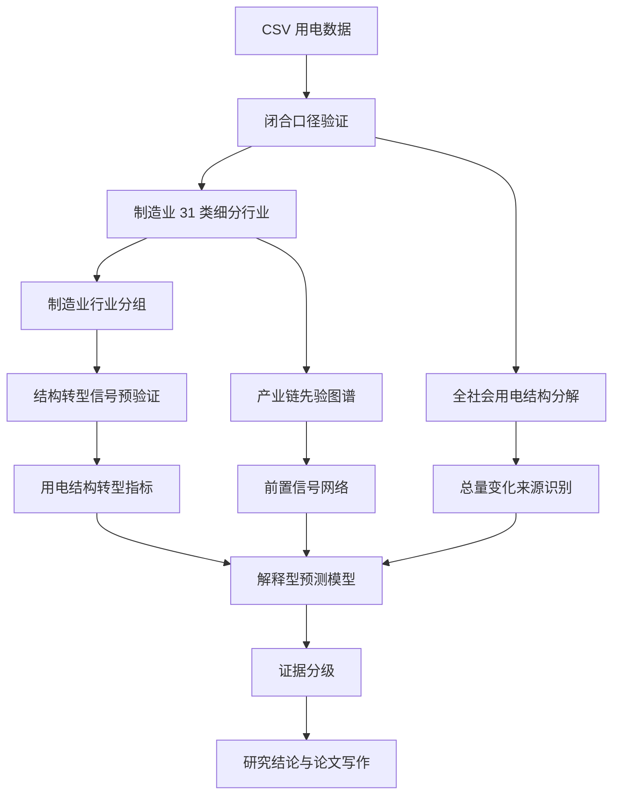

# 研究计划书：基于用电结构转型与前置信号网络的省域解释型预测研究

日期：2026-05-07  
版本：v0.3，加入结构转型信号预验证  
研究对象：福建省日度用电数据  
主数据：`分行业&分用电类别(1).csv`  
辅助数据：`福建全省用电量统计20230101至20260109.xlsx`  
关联文档：[[Data/福建两份用电数据口径解释-2026-05-07]]、[[Writing/研究计划书-福建数据口径修正版-2026-05-07]]、[[Writing/国家级大创对标与研究强化建议-2026-05-07]]、[[Literature/论文方法论对比-从论文到本项目方向-2026-05-07]]

## 1. 为什么要再次修改计划书

上一版计划书把研究主线定为：

> 完整用电结构分解 + 制造业 31 类行业传导网络。

这个方向已经比普通总量预测更严谨，因为它没有把 Excel 中只覆盖总量约 62.05% 的重点行业列误当成完整行业体系，而是改用 CSV 的闭合分类。

但是，如果研究只停留在：

```text
第一产业、第二产业、第三产业、居民生活占比
制造业占比
制造业 31 类行业网络
Granger 检验
```

那么它仍然容易显得传统。因为“三次产业结构分析”和“制造业占比分析”本身并不新，制造业行业网络如果只是画边，也容易变成常规时序分析。

因此，本版计划书把研究问题进一步升级为：

> 福建省用电增长背后的产业结构转换与前置信号识别。

制造业不再是“因为我们想分析制造业所以分析制造业”，而是因为数据已经显示：

1. 制造业长期占福建全社会用电量约 54%。
2. 制造业月度占比波动明显，约在 42% 到 60% 之间变化。
3. 制造业内部同时存在传统高耗能行业和先进制造、装备制造、电子信息等行业。
4. 这些行业增长差异明显，具备用电侧观察产业结构变化的价值。

所以新的核心逻辑是：

> 先用完整用电结构定位总量变化来源，再用制造业 31 类细分数据构造“用电结构转型指标”和“前置信号网络”，最后服务于解释型预测。

## 2. 新研究定位

### 2.1 推荐题目

推荐题目：

> 基于用电结构转型与前置信号网络的省域解释型预测研究：以福建省为例

备选题目：

1. 福建省用电结构转型识别与制造业前置信号网络研究。
2. 基于制造业用电结构转换的省域用电预测与产业运行识别。
3. 面向产业运行监测的省域用电结构分解、前置信号识别与预测研究。

### 2.2 这不是单纯预测

普通预测问：

> 未来全社会用电量是多少？

本项目问：

| 层次 | 问题 |
| --- | --- |
| 总量层 | 福建全社会用电量未来如何变化？ |
| 结构层 | 总量变化来自第二产业、第三产业、居民生活中的哪一部分？ |
| 转型层 | 制造业内部是否出现传统高耗能行业与先进制造行业的用电结构变化？ |
| 信号层 | 哪些行业用电变化能提前反映制造业或总用电变化？ |
| 预测层 | 结构变量和前置信号能否提高预测准确度？ |
| 解释层 | 预测结果背后反映怎样的产业运行状态？ |

因此，研究结果不只是一个预测数值，而是一套解释：

```text
未来总用电量变化
= 结构来源
+ 制造业内部转型信号
+ 前置行业信号
+ 季节和节假日波动
```

## 3. 数据基础与研究可行性

### 3.1 数据闭合关系

CSV 主数据中存在两个关键闭合关系。

第一，总量闭合：

```text
全社会用电总计
= 第一产业
+ 第二产业
+ 第三产业
+ 城乡居民生活用电合计
```

第二，制造业闭合：

```text
制造业
= 31 个制造业细分行业之和
```

这两个闭合关系意味着：

1. 我们可以严肃解释全社会用电总量。
2. 我们可以严肃分析制造业内部结构。
3. 不需要再把 Excel 的重点行业列强行拼成总量解释。

### 3.2 制造业为什么不是随便选的

数据检查显示，福建制造业占全社会用电量比例很高。

| 年份 | 第二产业占比 | 工业占比 | 制造业占比 | 第三产业占比 | 居民生活占比 |
| --- | ---: | ---: | ---: | ---: | ---: |
| 2023 | 58.94% | 58.00% | 54.16% | 18.64% | 20.42% |
| 2024 | 59.37% | 58.57% | 54.56% | 18.65% | 20.02% |
| 2025 | 58.96% | 58.28% | 54.13% | 18.78% | 20.32% |

这说明：

> 制造业不是一个普通子类，而是福建用电结构中的核心部分。

但本项目不会只写“制造业占比高”。真正要做的是：

> 利用制造业高占比和细分数据完整的特点，进一步识别制造业内部结构转换和前置信号。

### 3.3 制造业内部已经显示出差异

制造业中占比最高的行业包括：

| 行业 | 占制造业比例 | 占全社会用电比例 |
| --- | ---: | ---: |
| 黑色金属冶炼和压延加工业 | 13.82% | 7.51% |
| 非金属矿物制品业 | 9.47% | 5.14% |
| 化学原料和化学制品制造业 | 9.30% | 5.05% |
| 纺织业 | 8.13% | 4.41% |
| 计算机、通信和其他电子设备制造业 | 7.27% | 3.95% |
| 有色金属冶炼和压延加工业 | 7.03% | 3.82% |
| 电气机械和器材制造业 | 5.42% | 2.94% |

2023 到 2025 年增长较快的行业包括：

| 行业 | 2023 到 2025 增长 |
| --- | ---: |
| 化学原料和化学制品制造业 | 47.33% |
| 电气机械和器材制造业 | 44.28% |
| 医药制造业 | 33.82% |
| 仪器仪表制造业 | 32.98% |
| 汽车制造业 | 31.74% |
| 计算机、通信和其他电子设备制造业 | 22.80% |

这提示我们可以研究：

> 福建制造业用电增长到底来自传统材料与高耗能行业，还是来自装备制造、电子信息、医药、仪器仪表等更偏先进制造的行业？

这才是制造业分析的价值。

### 3.4 为什么要先证明“用电结构转型信号”是否存在

这里的“证明”不是数学定理意义上的证明，也不是一开始就宣称福建产业已经升级。它指的是一个实证研究开始前必须完成的预验证：

> 在进入复杂模型之前，先检查数据中是否真的存在足够稳定、足够明显、能够被产业分组解释的用电结构变化。

换句话说，我们要先确认这个项目的核心创新点不是凭想象搭出来的。如果数据里根本看不出结构转型信号，那么后面再做前置信号网络、解释型预测或 dashboard，都会变成在一个不稳的地基上堆模型。

本项目要预验证四件事。

| 要验证的问题 | 含义 | 如果成立，说明什么 | 如果不成立，怎么办 |
| --- | --- | --- | --- |
| 是否有变化 | 制造业内部各组占比是否随时间变化 | 结构不是静止的，值得继续研究 | 降级为结构描述和稳定性分析 |
| 变化是否足够大 | 转型指标的变化幅度是否超过日常噪声 | 变化有研究价值，不只是微小波动 | 改用月度/季度平滑或更换指标 |
| 变化是否稳定 | 换成周度、月度、滚动窗口后方向是否基本一致 | 信号不是某几天异常点造成的 | 做异常点解释，避免强结论 |
| 变化是否可解释 | 增长贡献是否集中在某些行业组或细分行业 | 可以连接到产业结构、产业链和预测解释 | 只能写成数据现象，暂不写产业解释 |

所以，“先证明”更准确地说是：

> 先证明“用电结构转型”在数据中可以作为一个可观测、可度量、可解释的研究对象。

这一步的结论边界必须写清楚：

1. 它不能直接证明真实产业升级，因为用电量不是工业增加值，也不是产值。
2. 它可以证明“用电侧结构转换信号”是否存在。
3. 它可以判断后续是否值得继续做前置信号网络。
4. 它可以为答辩提供一个很重要的逻辑：我们不是先选模型，而是先验证研究对象本身是否成立。

### 3.5 结构转型信号的预验证指标

预验证阶段至少计算四类指标。

第一类，制造业分组占比。设第 $g$ 个制造业分组在 $t$ 日的用电量为 $E_{g,t}$，制造业总用电量为 $E_{\mathrm{manu},t}$，则：

$$
S_{g,t}=\frac{E_{g,t}}{E_{\mathrm{manu},t}}.
$$

这里 $S_{g,t}$ 表示“第 $g$ 类行业在制造业内部占多少”。如果传统高耗能组、装备制造组、先进制造组的 $S_{g,t}$ 长期方向不同，就说明制造业内部结构不是完全同步变化。

第二类，结构转型差值。设装备与先进制造组占比为 $S_{\mathrm{adv},t}$，传统高耗能与材料组占比为 $S_{\mathrm{heavy},t}$，定义：

$$
T_t=S_{\mathrm{adv},t}-S_{\mathrm{heavy},t}.
$$

如果 $T_t$ 上升，表示装备与先进制造用电占比相对传统高耗能组增强；如果 $T_t$ 下降，则表示传统高耗能组相对更强。这个指标只能称为“用电侧转型信号”，不能直接称为“产业升级指数”。

第三类，增长贡献率。设第 $i$ 个行业从基期 $0$ 到时期 $1$ 的用电变化为 $\Delta E_i=E_{i,1}-E_{i,0}$，制造业总变化为 $\Delta E_{\mathrm{manu}}$，则：

$$
C_i=\frac{\Delta E_i}{\Delta E_{\mathrm{manu}}}.
$$

$C_i$ 回答的是“新增用电是谁贡献的”，它和占比不同。一个行业即使当前占比不高，只要 $C_i$ 高，也可能是新增动能；一个行业即使占比很高，如果 $C_i$ 低，说明它更像存量基础。

第四类，稳定性指标。对周度、月度和滚动窗口分别计算 $S_{g,t}$、$T_t$ 和 $C_i$，检查方向是否一致。稳定性不是要求每天都单调变化，而是要求换时间尺度后主要结论不完全反转。

预验证阶段的输出不是最终论文结论，而是一份“继续推进判断表”。

| 预验证结果 | 后续路线 |
| --- | --- |
| 转型指标方向清晰、增长贡献有集中行业 | 进入前置信号网络和解释型预测 |
| 转型指标有变化但不稳定 | 先做稳健性、异常点和节假日/季节调整 |
| 转型指标很弱 | 降级为总量预测 + 结构分解，不把转型作为主创新 |
| 转型指标与预测无关 | 保留结构解释，预测部分改用其他特征 |

## 4. 新版核心创新点

### 4.1 创新点评估总表

| 内容 | 是否传统 | 在本项目中的定位 |
| --- | --- | --- |
| 总量趋势预测 | 比较传统 | 必要基线 |
| 一二三产和居民生活占比 | 比较传统 | 用于定位总量结构来源 |
| 制造业占比分析 | 中等传统 | 用于证明制造业是核心窗口 |
| 制造业 31 类结构分析 | 中等 | 为结构转型指标提供基础 |
| 制造业用电结构转型指标 | 较有创新 | 主创新之一 |
| 前置信号行业识别 | 较有创新 | 主创新之一 |
| 产业链先验约束 + 时序检验 | 较有创新 | 保证网络不是乱连线 |
| 结构解释型预测 | 较有创新 | 把预测结果解释为结构来源 |
| 证据分级框架 | 中等创新 | 保证因果语言严谨 |

结论：

> 三次产业结构分析和制造业占比不是创新本身，只是研究地基。真正的创新在“结构转型指标、前置信号网络、解释型预测和证据分级”。

### 4.2 创新点一：用电结构转型指标

本项目可以把制造业 31 个细分行业按产业属性分组。

初步分组如下，后续可根据福建产业政策和行业分类进一步修订。

| 组别 | 包含行业示例 | 解释含义 |
| --- | --- | --- |
| 传统高耗能与材料行业 | 黑色金属、有色金属、非金属矿物、化学原料、石油煤炭加工、化学纤维 | 反映材料、基础工业和高耗能生产活动 |
| 消费与轻工制造 | 食品、饮料茶、纺织、服装、皮革、家具、造纸、印刷 | 反映消费品和轻工制造活动 |
| 装备制造 | 金属制品、通用设备、专用设备、汽车、运输设备、电气机械 | 反映装备和工业制造能力 |
| 先进制造与技术相关行业 | 计算机通信电子、仪器仪表、医药制造 | 反映电子信息、医药和技术密集型制造活动 |
| 其他制造 | 其他制造、废弃资源综合利用、设备修理 | 作为补充类别 |

定义若干指标：

```text
传统高耗能用电占比 = 传统高耗能与材料行业用电量 / 制造业用电量
```

```text
装备与先进制造用电占比 = 装备制造和先进制造行业用电量 / 制造业用电量
```

```text
用电结构转型差值 = 装备与先进制造用电占比 - 传统高耗能用电占比
```

也可以定义比例型指标：

```text
用电结构转型比 = 装备与先进制造用电量 / 传统高耗能与材料行业用电量
```

这些指标不能直接等同于“产业升级”，因为用电量不是增加值。但可以谨慎表述为：

> 用电侧观察到的制造业结构转换信号。

这就是一个比普通制造业占比更有研究性的指标。

### 4.3 创新点二：增长贡献从“谁用电多”改为“谁贡献新增量”

占比高不等于增长贡献大。

例如黑色金属可能占比很高，但新增量可能不如电气机械、医药或电子信息。

因此本项目要同时计算：

```text
行业存量占比
```

和：

```text
行业增长贡献
```

定义：

```text
行业 i 对制造业增长的贡献
= 行业 i 用电量变化 / 制造业用电量变化
```

这样可以区分：

| 类型 | 含义 |
| --- | --- |
| 高占比、高增长 | 当前核心驱动行业 |
| 高占比、低增长 | 存量重要但增长动力不足 |
| 低占比、高增长 | 潜在新动能 |
| 低占比、低增长 | 边缘或稳定行业 |

这个结果比单纯排名更有价值，因为它能回答：

> 福建制造业用电增长的新动能在哪里？

### 4.4 创新点三：前置信号行业识别

制造业网络如果只是画行业之间的边，仍然偏传统。

本项目应把网络问题改成：

> 哪些行业是制造业或总用电变化的前置信号？

候选目标变量：

```text
制造业用电量
第二产业用电量
全社会用电总计
传统高耗能组用电量
装备与先进制造组用电量
```

候选前置信号：

```text
制造业 31 个细分行业的滞后用电变化
```

如果某行业的历史变化稳定提升目标变量预测，则该行业可被视为前置信号行业。

评价前置信号不只看一次 Granger p 值，而要综合：

| 维度 | 含义 |
| --- | --- |
| 领先显著性 | Granger 或滞后回归是否显著 |
| 稳定性 | 换窗口、换滞后后是否仍存在 |
| 预测贡献 | 加入该行业后预测误差是否下降 |
| 产业解释 | 是否符合产业链或行业逻辑 |
| 提前期 | 领先 1 天、7 天、14 天还是更长 |

这可以形成：

> 福建制造业前置信号行业清单。

这个清单比单纯行业网络更有用。

### 4.5 创新点四：结构解释型预测

普通预测结果是：

```text
未来总用电量 = 某个数值
```

本项目的预测结果应写成：

```text
未来总用电量变化
主要来自第二产业、第三产业还是居民生活；
第二产业中制造业是否仍为核心来源；
制造业内部哪些行业提供前置信号；
结构转型指标是否对预测有帮助。
```

也就是说，预测结果要能解释。

模型比较：

| 模型 | 输入 | 目的 |
| --- | --- | --- |
| 总量自身模型 | 全社会用电总计历史 | 普通预测基线 |
| 完整结构增强模型 | 总量历史 + 一二三产 + 居民生活滞后项 | 检验结构变量是否有预测价值 |
| 转型指标增强模型 | 总量历史 + 制造业结构转型指标 | 检验结构转换信号是否有预测价值 |
| 前置信号增强模型 | 总量历史 + 前置信号行业滞后项 | 检验行业信号是否有预测价值 |

创新在于：

> 预测不是孤立算法竞赛，而是检验结构变量和前置信号是否真的携带未来信息。

### 4.6 创新点五：证据分级，避免“伪因果”

所有“传导”“领先”“影响”都要分级。

| 证据等级 | 判断标准 | 允许写法 |
| --- | --- | --- |
| E0 描述事实 | 占比、趋势、相关 | 某行业占比上升 |
| E1 结构转型信号 | 分组占比或转型指标变化 | 用电侧出现结构转换信号 |
| E2 时序领先 | 滞后项显著或 Granger 成立 | A 对 B 有预测领先信息 |
| E3 稳健前置信号 | 滚动窗口、不同滞后仍有效 | A 是较稳定前置信号 |
| E4 预测贡献 | 加入 A 后误差下降 | A 对预测有实际贡献 |
| E5 产业解释支持 | 产业链或投入产出支持 | A-B 关系具有产业结构解释 |

本项目一般不写强因果，只写：

> 预测领先、结构支持、预测贡献。

## 5. 论文方法如何放进新版计划

| 参考论文或方法 | 我们学什么 | 在新版计划中的位置 |
| --- | --- | --- |
| 李龙飞 | 先筛选前置行业，再增强预测 | 前置信号行业识别、结构增强预测 |
| 包永迪 | ADF、Granger、VAR、IRF 的传导分析流程 | 制造业行业时序领先和冲击响应 |
| 方智淳 | 产业链图谱先行，再分析传导和预警 | 产业链先验约束、前置信号解释 |
| 李文娜 | 产业结构和投入产出解释 | 对行业边和行业分组提供经济解释 |
| Granger 1969 | 预测意义上的因果边界 | 规范“时序领先”语言 |
| Duan 直接转移熵 | 区分直接路径和间接路径 | 网络过密时做局部直接路径检验 |
| 王双成时间序列贝叶斯网络 | 状态化预警 | 把行业增长状态转成景气预警规则 |

### 5.1 李龙飞：从“因果筛选预测”改造为“前置信号识别”

李龙飞论文给我们的核心启发是：

> 行业变量不是随便加入预测模型，而是先判断哪些行业具有领先信息。

本项目可以改造为：

```text
制造业 31 类行业
-> 筛选对制造业总量、第二产业总量、全社会总量有领先信息的行业
-> 建立前置信号清单
-> 检验加入这些信号后预测是否提升
```

这比直接把所有行业变量放进模型更严谨。

### 5.2 包永迪：用于前置信号和传导边的基本检验

包永迪的方法链：

```text
平稳性检查
-> Granger 检验
-> VAR
-> IRF
-> 预测验证
```

在本项目中用于两个地方：

1. 行业对目标变量的前置信号检验。
2. 重点产业链内部行业之间的传导边检验。

例如：

```text
化学原料和化学制品制造业
-> 橡胶和塑料制品业
```

或者：

```text
电气机械和器材制造业
-> 制造业总用电量
```

注意结论只能写为：

> 历史用电变化具有预测领先信息。

### 5.3 方智淳：制造业网络不能先跑模型再解释

方智淳最值得借鉴的是：

> 产业链图谱先行。

本项目应先构造福建制造业产业链先验：

| 产业链 | 对应行业 |
| --- | --- |
| 化工-橡塑链 | 石油煤炭加工、化学原料、化纤、橡胶塑料 |
| 纺织服装链 | 纺织、纺织服装、皮革制鞋 |
| 食品加工链 | 农副食品、食品制造、酒饮料茶 |
| 装备制造链 | 金属制品、通用设备、专用设备、汽车、电气机械 |
| 电子信息链 | 计算机通信电子、仪器仪表、电气机械 |

然后再检查：

> 这些先验链条上的行业是否真的存在时序领先或预测贡献？

### 5.4 李文娜：用于防止统计边缺少经济含义

李文娜的投入产出和产业关联思想告诉我们：

> 行业边不能只靠统计显著，还要能回到产业结构解释。

本项目当前未必马上有福建投入产出表，但可以先使用产业链先验和政策材料进行解释。

如果后续找到福建投入产出表，可以进一步验证：

1. 某行业是否对其他行业有强拉动。
2. 某行业是否对全省需求变化敏感。
3. 统计发现的前置信号是否有投入产出结构支持。

### 5.5 Duan 和王双成：作为增强模块

Duan 的直接转移熵适合在网络边过密时回答：

> A 到 C 是直接领先，还是通过 B 间接传导？

王双成的时间序列贝叶斯网络适合在后续做：

> 制造业景气状态预警。

例如把行业增长分成：

```text
高增长
温和增长
平稳
下降
```

再学习：

```text
某些前置信号行业处于高增长状态时，制造业总量下期上升概率是多少？
```

这可以作为答辩展示或后续扩展。

## 6. 新版技术路线



技术路线包括六步：

1. 数据闭合验证。
2. 总量结构分解。
3. 制造业行业分组与结构转型信号预验证。
4. 结构转型指标构造与解释。
5. 前置信号行业识别。
6. 解释型预测建模。
7. 证据分级与产业解释。

## 7. 具体实施方案

### 7.1 阶段一：数据整理和闭合验证

从 CSV 筛选：

```text
类型 = 用电
汇总方式 = 按地市汇总
单位名称 = 全省
```

生成长表：

| 日期 | 行业代码 | 行业名称 | 电量 |
| --- | --- | --- | --- |
| 2023-01-01 | AAAA | 全社会用电总计 | ... |

验证：

```text
全社会用电总计
= 第一产业 + 第二产业 + 第三产业 + 城乡居民生活
```

以及：

```text
制造业
= 31 个制造业细分行业之和
```

输出：

1. 数据字典。
2. 缺失异常检查。
3. 闭合误差表。
4. 用电和售电口径说明。

### 7.2 阶段二：总量结构分解

这一步不是创新核心，但必须做。

输出：

1. 总用电量趋势。
2. 第一产业、第二产业、第三产业、居民生活占比。
3. 各结构对总量变化的贡献。
4. 第二产业、工业、制造业在总量中的位置。

关键结论不是简单说“第二产业占比高”，而是回答：

> 福建用电增长主要由哪个结构部分驱动？

### 7.3 阶段三：制造业用电结构转型指标

把制造业 31 个细分行业分组，形成：

1. 传统高耗能与材料行业组。
2. 消费与轻工制造组。
3. 装备制造组。
4. 先进制造与技术相关行业组。
5. 其他制造组。

计算：

```text
各组用电占制造业比例
各组对制造业新增用电贡献
装备与先进制造占比 - 传统高耗能占比
装备与先进制造用电量 / 传统高耗能用电量
```

输出：

| 结果 | 作用 |
| --- | --- |
| 制造业分组占比图 | 看结构变化 |
| 转型指标趋势图 | 看用电侧结构转换信号 |
| 增长贡献象限图 | 区分存量核心和新增动能 |
| 行业分组说明表 | 保证分组可解释 |

在这一阶段，必须先完成“结构转型信号预验证”，不能一上来就把转型指标当成已经成立的创新点。

预验证的最低通过标准为：

1. 至少一个制造业分组占比在年度或月度尺度上出现可解释变化。
2. 转型差值或转型比值不是完全围绕零随机摆动。
3. 增长贡献能够识别出若干“高占比高增长”“低占比高增长”或“高占比低增长”的行业。
4. 换成周度、月度或滚动窗口后，核心判断不完全反转。

如果最低标准不满足，论文中不能把“用电结构转型指标”写成主创新，只能写成探索性指标；此时主线应回到“闭合口径下的省域用电结构分解与解释型预测”。

### 7.4 阶段四：前置信号行业识别

目标变量包括：

```text
全社会用电总计
第二产业用电
工业用电
制造业用电
传统高耗能组用电
装备与先进制造组用电
```

候选信号包括：

```text
制造业 31 个细分行业的滞后用电量或增长率
```

方法：

1. 滞后相关初筛。
2. Granger 检验。
3. 滚动窗口稳定性检查。
4. 预测误差增益检验。
5. 产业链先验解释。

输出：

| 结果 | 作用 |
| --- | --- |
| 前置信号行业排名 | 哪些行业最早释放信号 |
| 领先期分布 | 领先 1 天、7 天、14 天还是更长 |
| 滚动稳定性表 | 检查是否偶然显著 |
| 产业链解释表 | 判断是否有现实解释 |

### 7.5 阶段五：解释型预测

比较四类模型：

| 模型 | 输入 | 目的 |
| --- | --- | --- |
| 基线预测 | 目标变量自身历史 | 最低标准 |
| 结构增强预测 | 加入一二三产和居民滞后项 | 看完整结构是否有用 |
| 转型指标增强预测 | 加入制造业结构转型指标 | 看结构转换是否有用 |
| 前置信号增强预测 | 加入筛选出的前置信号行业 | 看行业信号是否有用 |

评价：

```text
滚动窗口回测
MAE
RMSE
SMAPE
方向准确率
```

最终不是只报告哪个模型误差最低，而是解释：

> 哪类信息对预测有贡献，是总量自身历史、结构分解、转型指标，还是前置信号行业？

### 7.6 阶段六：产业解释与证据分级

所有结论都要进入证据表。

示例：

| 结论 | 证据 | 等级 |
| --- | --- | --- |
| 制造业是福建用电核心部分 | 制造业占总量约 54% | E0 |
| 装备与先进制造用电占比上升 | 转型指标趋势 | E1 |
| 电气机械对制造业总量有领先信息 | Granger + 滚动稳定 | E2/E3 |
| 加入电气机械后制造业预测误差下降 | 回测误差下降 | E4 |
| 电气机械与电子信息链条有产业解释 | 产业链先验支持 | E5 |

这样写能避免结论空泛。

## 8. 预期成果

### 8.1 方法成果

1. 福建用电结构闭合分解框架。
2. 制造业用电结构转型指标。
3. 制造业前置信号行业识别方法。
4. 结构解释型预测模型比较框架。
5. 时序领先证据分级表。

### 8.2 数据成果

1. 清洗后的全省用电长表。
2. 一二三产和居民生活结构表。
3. 制造业 31 类长表。
4. 制造业行业分组表。
5. 前置信号行业清单。

### 8.3 图表成果

| 图表 | 作用 |
| --- | --- |
| 总用电量和四大结构堆叠图 | 展示总量来源 |
| 制造业占总量趋势图 | 证明制造业是核心窗口 |
| 制造业分组占比图 | 展示结构转换 |
| 转型指标趋势图 | 展示用电侧转型信号 |
| 行业增长贡献象限图 | 识别新动能 |
| 前置信号网络图 | 展示领先关系 |
| 预测误差对比图 | 检验方法价值 |
| 证据等级表 | 保证结论严谨 |

### 8.4 研究结论可能长什么样

最终结论不是预设的，但可能形成几类发现。

第一类，总量结构发现：

> 福建全社会用电量中，第二产业和制造业长期占据核心地位；居民生活和第三产业贡献季节性波动。

第二类，结构转型发现：

> 制造业内部传统高耗能行业、装备制造、电子信息、医药等行业的用电增长表现不同，可能显示用电侧产业结构转换信号。

第三类，前置信号发现：

> 某些行业的用电变化对制造业总量或全社会用电总量具有稳定预测领先信息。

第四类，预测发现：

> 结构变量、转型指标或前置信号行业是否能提升滚动预测表现。

第五类，方法边界：

> 本研究不宣称强因果，而是提供“结构变化 + 时序领先 + 预测贡献 + 产业解释”的分级证据。

## 9. 论文结构建议

1. 绪论
   - 用电量预测为什么需要结构解释。
   - 福建省制造业用电占比高的研究背景。
   - 普通总量预测和普通结构分析的不足。
   - 本文创新点。

2. 数据说明与口径处理
   - 两份福建数据介绍。
   - 用电和售电口径区分。
   - 总量闭合与制造业闭合验证。

3. 福建省用电结构分解
   - 全社会用电趋势。
   - 一二三产和居民生活结构。
   - 第二产业、工业和制造业的位置。

4. 制造业用电结构转型指标
   - 制造业 31 类行业分组。
   - 存量占比和增长贡献。
   - 转型指标构造和趋势。

5. 制造业前置信号网络
   - 产业链先验图谱。
   - Granger 和滞后预测检验。
   - 稳定性检查。
   - 前置信号行业排名。

6. 结构解释型预测
   - 总量基线预测。
   - 结构增强预测。
   - 转型指标增强预测。
   - 前置信号增强预测。
   - 误差比较和解释。

7. 结论与展望
   - 主要发现。
   - 方法贡献。
   - 局限性。
   - 后续加入天气、节假日、投入产出表、政策冲击和行业增加值。

## 10. 当前创新点是否足够

当前创新点可以分成三档。

### 10.1 基础但不创新

这些必须做，但不能当主要创新：

1. 总用电量趋势预测。
2. 第一、第二、第三产业占比。
3. 制造业占总量比例。
4. 相关系数热力图。

### 10.2 有一定创新

这些可以作为方法特色：

1. 使用闭合分类而不是混乱相加。
2. 制造业 31 类完整网络。
3. 产业链先验约束。
4. 证据分级语言。

### 10.3 最值得作为主创新

这些应写进论文摘要和答辩：

1. **制造业用电结构转型指标**：从用电侧识别传统高耗能、装备制造、先进制造之间的结构变化。
2. **前置信号行业识别**：找出能提前反映制造业或全社会用电变化的行业。
3. **结构解释型预测**：预测不只给数值，还解释预测变化来自结构、转型指标还是前置信号。

所以，最终创新点建议写成：

> 本研究基于福建省闭合的分行业日度用电数据，构建全社会用电结构分解框架；进一步利用制造业 31 个细分行业构造用电结构转型指标，并结合产业链先验与时序领先检验识别制造业前置信号行业；最后将结构变量、转型指标和前置信号纳入预测模型，形成可解释的省域用电预测框架。

## 11. 当前最应该先做什么

下一步不要直接跑复杂模型，先做五件事：

1. 建立 CSV 长表和变量字典。
2. 完成总量闭合、制造业闭合验证。
3. 制定制造业 31 类行业分组方案。
4. 做结构转型信号预验证：占比变化、转型差值、增长贡献、稳定性检查。
5. 画制造业分组占比、转型指标初图和增长贡献象限图。

如果这些图和指标能显示出清晰结构变化，再进入前置信号网络和预测增强。如果信号不清晰，就不要硬做“转型创新”，而是及时调整为更稳妥的结构分解和解释型预测路线。
