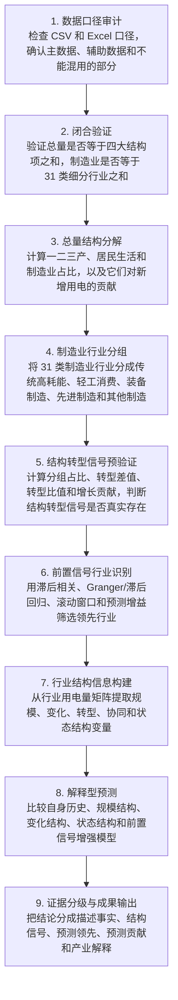

# 福建省用电结构转型与解释型预测研究：研究过程主文档

日期：2026-05-07  
定位：写给研究者自己看的全过程说明书。  
主数据：`Sources/原始数据/分行业&分用电类别(1).csv`  
辅助数据：`Sources/原始数据/福建全省用电量统计20230101至20260109.xlsx`

> 这不是最终论文，而是研究过程主文档。以后每推进一步，都要在这里记录：我们做了什么、为什么这样做、公式怎么来、结果是什么、结果说明什么、下一步准备做什么。最终论文可以从本文档中提炼，但本文档优先保证“看得懂”和“可追溯”。

## 目录

1. [[#研究开头：当前研究目标]]
2. [[#研究开头：为什么不能一上来就做复杂预测模型]]
3. [[#研究开头：总体技术路线]]
4. [[#第一阶段：数据整理与闭合验证]]
5. [[#第二阶段：总量结构分解]]
6. [[#第三阶段：制造业结构转型信号预验证]]
7. [[#第四阶段：前置信号行业识别]]
8. [[#第五阶段：行业结构信息构建]]
9. [[#第六阶段：解释型预测建模]]
10. [[#证据边界]]
11. [[#当前已经确定的下一步]]
12. [[#文档收敛规则]]

---

## 研究开头：当前研究目标

本项目的实证对象是福建省日度用电数据。当前主数据为：

- `分行业&分用电类别(1).csv`：包含分行业、分用电类别的日度数据，是本研究的主数据。
- `福建全省用电量统计20230101至20260109.xlsx`：包含全省和地市层面的宽表数据，作为辅助核对和展示数据。

本项目不是只回答：

> 未来用电量是多少？

更核心的问题是：

> 福建省用电变化背后的结构来源是什么？制造业内部是否存在可观测的用电结构转型信号？哪些行业的用电变化能够作为未来制造业或全社会用电变化的前置信号？这些结构信息能否提升预测，并让预测结果更容易解释？

因此，本研究希望形成一套面向省域产业运行监测的分析框架：

1. 用闭合口径解释全社会用电总量。
2. 用制造业 31 类细分行业观察制造业内部结构变化。
3. 构造用电结构转型指标，判断是否存在稳定的结构转换信号。
4. 识别前置信号行业，判断哪些行业对未来总量或制造业变化有预测领先信息。
5. 将结构变量、转型指标和前置信号纳入预测模型，形成解释型预测。
6. 最终形成研究报告、论文草稿、可复现实验代码、图表和可展示原型。

---

## 研究开头：为什么不能一上来就做复杂预测模型

如果直接使用机器学习或时间序列模型预测总用电量，可能会得到一个误差指标，但它很难回答以下问题：

- 预测值为什么会上升或下降？
- 变化主要来自第二产业、第三产业还是居民生活？
- 制造业内部是传统高耗能行业在变化，还是装备制造、电子信息、医药等行业在变化？
- 哪些行业先变化，哪些行业后变化？
- 这些行业信号加入模型后，是否真的提高了预测表现？

所以本研究的第一步不是追求复杂模型，而是先验证研究对象本身是否成立。也就是说，先检查：

> “用电结构转型”在数据中是否可以作为一个可观测、可度量、可解释的研究对象。

如果这个信号不存在或非常弱，后续就不能硬把它写成主创新；如果它存在且较稳定，再继续做前置信号网络和解释型预测才有意义。

---

## 研究开头：数据处理与标准化原则

这里要先说明一个容易误解的点：我们不是“不做数据处理”，而是不同研究阶段需要不同类型的数据处理。

第一阶段和第二阶段主要做的是口径审计、闭合验证、结构占比和增长贡献。这些步骤必须尽量保留原始电量尺度，因为它们回答的问题是：

> 总量能不能由结构项加总解释？谁占全社会用电更多？谁贡献了新增用电？

如果在这一步就把每个行业都标准化成均值为 0、标准差为 1 的变量，那么“加总闭合”“占比”“贡献率”这些经济含义会被破坏。例如第二产业年用电量本来可以和全社会总用电量相除得到占比；但标准化以后，变量已经不再是电量本身，就不能再拿来做加总解释。

因此，本项目的数据处理分成四层。

| 层次 | 处理内容 | 为什么这样做 | 是否标准化 |
| --- | --- | --- | --- |
| 原始数据层 | 保留 CSV 和 Excel 原文件，不直接改动。 | 保证以后任何结果都能回到原始来源。 | 不标准化。 |
| 口径清洗层 | 筛选 `类型=用电`、`汇总方式=按地市汇总`、`单位名称=全省`，转成长表和宽表。 | 保证我们分析的是同一个统计口径。 | 不标准化。 |
| 结构解释层 | 计算闭合误差、占比、增长贡献、月度/年度加总。 | 这些指标依赖真实电量和真实加总关系。 | 不标准化，但会计算占比和增长率。 |
| 建模输入层 | 做滞后项、同比/环比增长率、对数变换、标准化、季节变量等。 | 预测模型、回归模型、网络筛选需要可比较、稳定的输入。 | 视模型需要标准化。 |

### 标准化到底是什么

最常见的标准化是 z-score 标准化：

$$
z_{i,t}
=
\frac{x_{i,t}-\bar{x}_i}{s_i}.
$$

其中：

- $x_{i,t}$ 是第 $i$ 个行业在第 $t$ 天的原始用电量；
- $\bar{x}_i$ 是该行业在训练样本中的平均用电量；
- $s_i$ 是该行业在训练样本中的标准差；
- $z_{i,t}$ 是标准化后的数值。

标准化后的变量表示“当前值比该行业自己的平均水平高几个标准差”。这样做的好处是，不同行业的量纲和规模被拉到可比较范围。比如一个大行业每天几十亿电量，一个小行业每天几千万电量，原始数值差距巨大；标准化后，模型可以更公平地比较它们的波动。

但标准化也有代价：标准化后的数值不再是“电量”，不能直接解释为实际用电规模。所以标准化适合建模输入，不适合直接做结构解释。

### 本项目后续会使用哪些变换

后续进入制造业结构转型和前置信号识别时，会根据目的选择不同变换。

| 目的 | 推荐变量 | 公式或说明 | 用途 |
| --- | --- | --- | --- |
| 看行业规模 | 原始电量 $E_{i,t}$ | 不变换。 | 判断哪个行业用电量大。 |
| 看结构位置 | 占比 $S_{i,t}=E_{i,t}/E_{\mathrm{manu},t}$ | 行业电量除以制造业总量。 | 判断行业在制造业内部的位置。 |
| 看增长变化 | 同比增长率 $g_{i,t}^{\mathrm{yoy}}=(E_{i,t}-E_{i,t-12})/E_{i,t-12}$ | 月度时用去年同月比较。 | 减少季节性干扰。 |
| 看短期波动 | 环比增长率或差分 $\Delta E_{i,t}=E_{i,t}-E_{i,t-1}$ | 当前值减上一期。 | 分析变化方向和冲击。 |
| 做回归/机器学习 | 标准化变量 $z_{i,t}$ | 只用训练集均值和标准差。 | 防止大规模行业压制小规模行业。 |
| 做网络筛选 | 增长率、差分或标准化序列 | 避免只因为共同趋势得到虚假关系。 | 用于滞后相关、Granger 或前置信号筛选。 |

这里有一个很重要的防泄漏原则：如果做预测模型，标准化的均值 $\bar{x}_i$ 和标准差 $s_i$ 只能用训练集计算，不能用包含测试期的数据计算。否则模型虽然没有直接看到测试期目标值，但已经提前使用了测试期分布信息，会造成未来信息泄漏。

### 为什么暂时不分析各省用电量变化

跨省比较当然有研究价值，而且以后可以作为扩展方向。例如可以比较福建、广东、浙江、江苏等沿海制造业省份的用电结构变化，判断福建的结构特征是全国共性，还是区域特性。

但是当前阶段暂时不把“各省比较”作为主线，原因有三个。

第一，当前手里最完整的是福建省这套日度分行业数据，尤其是制造业 31 类细分行业可以闭合。跨省公开数据通常更容易找到年度或月度总量，不一定能找到同样细的日度制造业分行业数据。如果不同省份的数据频率、口径、行业分类不一致，强行比较会带来很大偏差。

第二，我们现在的核心创新更适合落在“制造业内部结构转型 + 前置信号 + 解释型预测”上。这个方向需要细行业数据，而福建数据正好完整。相比之下，跨省比较如果只有总量和三次产业，容易变成普通描述性分析，创新性反而不如制造业细分结构。

第三，跨省比较可以作为后续稳健性或外推检查，而不是当前主线。也就是说，等福建制造业方法跑通后，如果能找到其他省份类似口径的数据，就可以检验：

1. 福建识别出的结构转型指标在其他省份是否也存在；
2. 福建的前置信号行业是否具有普遍性；
3. 不同省份制造业结构差异是否会改变预测模型表现；
4. 福建是否属于某种省域类型，例如制造业主导型、服务业增长型或居民生活波动型。

因此，当前决策是：主线继续研究福建制造业，因为这里数据完整、方法有代表性，也更容易形成可复现的研究框架；跨省比较先作为“后续扩展方向”和“稳健性检查方向”保留。

---

## 研究开头：总体技术路线

本研究暂定为八个阶段。

| 阶段 | 要做什么 | 这一阶段解决的问题 |
| --- | --- | --- |
| 一 | 数据整理与闭合验证 | 数据能不能严肃使用？总量是否能由结构项闭合解释？制造业是否能由 31 类细分行业闭合解释？ |
| 二 | 总量结构分解 | 全社会用电变化来自第一产业、第二产业、第三产业还是居民生活？ |
| 三 | 制造业行业分组 | 如何把 31 类制造业行业整理成可解释的产业组？ |
| 四 | 结构转型信号预验证 | 制造业内部是否真的存在稳定、明显、可解释的结构变化？ |
| 五 | 前置信号行业识别 | 哪些行业历史变化对制造业或全社会用电有预测领先信息？ |
| 六 | 行业结构信息构建 | 除了 $T/R$，还可以从行业用电量矩阵中提取哪些有用结构变量？ |
| 七 | 解释型预测建模 | 结构变量、转型指标和前置信号能否提升预测，并解释预测来源？ |
| 八 | 证据分级与成果表达 | 哪些结论只是描述，哪些是预测领先，哪些有产业解释，哪些不能说成因果？ |

这一路线的逻辑是：

$$
\text{数据口径清楚}
\rightarrow
\text{结构分解可信}
\rightarrow
\text{转型信号可验证}
\rightarrow
\text{前置信号可筛选}
\rightarrow
\text{结构信息可建模}
\rightarrow
\text{预测结果可解释}.
$$

### 详细研究流程图

下面这张 PNG 图是主阅读版本。如果 Obsidian 或其他 Markdown 预览器没有启用 Mermaid，直接看这张图即可。

下面的 Mermaid 代码块只作为可编辑备份。若它在某些预览器里不显示，不影响本文档阅读。

### 每一步使用的方法、得到的结果和结果意义

| 环节 | 方法 | 结果 | 意义 |
| --- | --- | --- | --- |
| 数据口径审计 | 读取 CSV 和 Excel 的字段、日期范围、行列结构和统计口径；区分用电/售电、全省/地市、完整分类/重点行业列。 | 得到主数据和辅助数据的分工：CSV 作为结构主数据，Excel 作为辅助核对和展示。 | 避免把不同统计口径混合，保证研究不是从错误数据拼接开始。 |
| 闭合验证 | 计算总量闭合误差 $\Delta^{\mathrm{total}}_t$ 和制造业闭合误差 $\Delta^{\mathrm{manu}}_t$，并检查相对误差。 | 若误差接近 0，说明总量和制造业内部结构可以被加总解释。 | 这是后续结构分析的合法性基础；如果闭合失败，就不能继续解释结构。 |
| 总量结构分解 | 计算结构占比 $S_{k,t}=E_{k,t}/E_{\mathrm{total},t}$ 和增长贡献 $C_k=\Delta E_k/\Delta E_{\mathrm{total}}$。 | 得到一二三产、居民生活和制造业的占比、趋势和新增贡献。 | 回答“福建用电变化主要来自哪里”，为后续制造业研究提供背景。 |
| 制造业行业分组 | 结合行业名称、国民经济行业分类含义和福建产业背景，把 31 类制造业分为若干产业组。 | 得到制造业分组表和每个分组的日度用电序列。 | 把零散行业变成可解释的产业结构，避免只做杂乱行业排名。 |
| 结构转型信号预验证 | 计算分组占比、结构转型差值 $T_t=S_{\mathrm{adv},t}-S_{\mathrm{heavy},t}$、结构转型比值 $R_t=E_{\mathrm{adv},t}/E_{\mathrm{heavy},t}$ 和增长贡献。 | 得到结构转型指标趋势图、分组占比图和增长贡献象限图。 | 判断“用电结构转型”是否真的能作为本项目的核心研究对象。 |
| 前置信号行业识别 | 使用滞后相关、Granger 检验或滞后回归、滚动窗口稳定性和预测误差增益检验。 | 得到前置信号行业清单、领先期分布和稳定性表。 | 回答哪些行业的历史变化能够提前提示制造业或总用电变化。 |
| 行业结构信息构建 | 从月度行业用电量矩阵提取占比、HHI、熵、结构距离、状态标签和协同相关网络。 | 得到结构特征总表、行业画像、状态标签和协同结构图。 | 避免只靠一个比值支撑研究，明确哪些结构变量能进入预测。 |
| 解释型预测 | 比较自身历史、规模结构、变化结构、状态结构和前置信号增强模型；使用滚动窗口回测。 | 得到 MAE、RMSE、SMAPE、方向准确率和误差分解。 | 不只看预测准不准，还看结构信息是否真的帮助预测、如何帮助预测。 |
| 证据分级与成果输出 | 把每条结论标为 E0 至 E5：描述事实、结构信号、时序领先、稳健前置信号、预测贡献、产业解释。 | 得到可写入论文和答辩的结论边界表。 | 防止把相关、预测领先或 Granger 结果误写成强因果，保证项目严谨可信。 |

### 后续每个结果的阅读格式

本项目后续每个结果都要按下面的格式解释：

1. **这个结果从哪里来**：说明使用哪个数据表、哪个字段、哪个时间范围。
2. **公式是什么**：写出计算公式，并解释公式中每个符号的含义。
3. **数值结果是什么**：给出表格、图或关键统计量。
4. **它说明什么**：解释它支持哪一个研究判断。
5. **它不能说明什么**：说明结论边界，特别是不把预测领先写成强因果。
6. **下一步是什么**：说明这个结果如何决定后续分析路线。

---

## 第一阶段：数据整理与闭合验证

### 为什么要做闭合验证

所谓闭合验证，就是检查一个总量是否能由若干组成部分加总得到。它的意义是防止我们把不同口径的数据乱加在一起。

本项目已经发现一个重要事实：Excel 文件中的若干重点行业列只能覆盖全社会总量的一部分，不能直接当作完整行业体系。相比之下，CSV 文件中存在较完整的分类结构，因此后续主线必须以 CSV 为主。

### 总量闭合关系

对全社会用电总计，预期闭合关系为：

$$
E_{\mathrm{total},t}
=
E_{\mathrm{primary},t}
+
E_{\mathrm{secondary},t}
+
E_{\mathrm{tertiary},t}
+
E_{\mathrm{residential},t}.
$$

其中：

- $E_{\mathrm{total},t}$ 表示第 $t$ 天全社会用电总计；
- $E_{\mathrm{primary},t}$ 表示第一产业用电；
- $E_{\mathrm{secondary},t}$ 表示第二产业用电；
- $E_{\mathrm{tertiary},t}$ 表示第三产业用电；
- $E_{\mathrm{residential},t}$ 表示城乡居民生活用电合计。

我们要计算闭合误差：

$$
\Delta^{\mathrm{total}}_t
=
E_{\mathrm{total},t}
-
\left(
E_{\mathrm{primary},t}
+
E_{\mathrm{secondary},t}
+
E_{\mathrm{tertiary},t}
+
E_{\mathrm{residential},t}
\right).
$$

如果 $\Delta^{\mathrm{total}}_t$ 接近 0，说明这个口径可以用来解释总量。如果误差很大，就必须先找出原因，不能继续建模。

### 制造业闭合关系

对制造业，预期闭合关系为：

$$
E_{\mathrm{manu},t}
=
\sum_{i=1}^{31} E_{i,t},
$$

其中 $E_{\mathrm{manu},t}$ 表示第 $t$ 天制造业总用电量，$E_{i,t}$ 表示第 $i$ 个制造业细分行业的用电量。

对应闭合误差为：

$$
\Delta^{\mathrm{manu}}_t
=
E_{\mathrm{manu},t}
-
\sum_{i=1}^{31} E_{i,t}.
$$

这一关系很关键。只有制造业可以被 31 类细分行业基本闭合解释，我们才有资格继续分析制造业内部结构。

### 本轮实际处理了什么

本轮使用脚本 `Experiments/scripts/fujian_structure_stage1.py` 重新处理 CSV 主数据。处理时只保留最适合本研究主线的全省用电口径：

$$
\text{类型}=\text{用电},\qquad
\text{汇总方式}=\text{按地市汇总},\qquad
\text{单位名称}=\text{全省}.
$$

这样做的原因是：本阶段要研究福建省整体结构，而不是先研究地市差异；同时我们要使用“用电”口径，而不是“售电”口径，避免两个统计口径混用。

脚本完成了四件事：

1. 将 CSV 宽表转为长表。原表中每一天是一列，不利于后续建模；长表把每一行整理成“日期--行业--电量”的形式。
2. 生成全省日度宽表。宽表用于闭合验证、结构占比、制造业分组和后续建模。
3. 生成行业字典。记录每个行业名称、行业代码、行号和是否进入制造业分组。
4. 计算总量闭合和制造业闭合误差。

本轮生成的核心文件如下：

| 输出类别 | 作用 |
| --- | --- |
| 全省用电日度长表 | 后续结构分析和建模的主数据之一，每行对应一个日期、一个行业或类别和一个电量值。 |
| 全省用电日度宽表 | 适合直接取总量、四大结构项、制造业总量和制造业细分项。 |
| 全省口径行业字典 | 记录 67 个行业/类别的原始名称、清洗后名称、代码和行号。 |
| 制造业行业分组表 | 将 31 个制造业细分行业映射到传统高耗能、轻工消费、装备制造、先进制造和其他制造。 |
| 总量闭合每日误差表 | 检查全社会用电总计是否等于第一产业、第二产业、第三产业和居民生活之和。 |
| 制造业闭合每日误差表 | 检查制造业总量是否等于 31 个制造业细分行业之和。 |
| 年度结构占比表 | 给出年度一二三产、居民生活和制造业占全社会用电量的比例。 |

这些文件统一保存在 `structure_stage1` 子目录下：处理后数据在 `Data/processed/`，字典在 `Data/dictionary/`，计算结果在 `Experiments/outputs/`。

### 本轮数据处理结果

本轮从 CSV 中抽取到：

- 日期范围：2022 年 1 月 1 日至 2026 年 1 月 10 日；
- 日期列数：1471 列；
- 全省用电口径下的行业/类别行数：67 行；
- 转换后的长表行数：98557 行；
- 预期制造业细分行业数：31 个；
- 实际找到的制造业细分行业数：31 个。

这说明第一阶段最重要的数据条件成立：CSV 中不仅有全社会总量和四大结构项，也有完整的制造业 31 类细分行业。

### 闭合验证结果

| 检查 | 天数 | 最大绝对误差 | 平均绝对误差 | 最大相对绝对误差 | 平均相对绝对误差 |
| --- | ---: | ---: | ---: | ---: | ---: |
| 全社会总量闭合 | 1471 | 0.56 | 0.06 | 0.000000% | 0.000000% |
| 制造业 31 类闭合 | 1471 | 128.07 | 0.62 | 0.000027% | 0.000000% |

这个结果说明：

- 全社会总量闭合的平均相对绝对误差约为 $7.42\times10^{-11}$，可以视为数值舍入误差。
- 制造业 31 类闭合的平均相对绝对误差约为 $1.37\times10^{-9}$，也可以视为数值舍入误差。
- 因此，后续可以严肃使用这两个闭合关系：一是全社会总量由第一产业、第二产业、第三产业和居民生活解释；二是制造业由 31 类制造业细分行业解释。

这里要注意，闭合验证只证明“统计口径上可以加总解释”，不证明经济因果关系。它的作用是给后续结构分析提供可信数据地基。

### 第一阶段结论

> 福建 CSV 主数据在“用电--按地市汇总--全省”口径下具有很好的闭合性。全社会用电总计可以由四大结构项闭合解释，制造业可以由 31 个细分行业闭合解释。因此，本项目有资格进入总量结构分解和制造业结构转型信号预验证。

下一阶段要做的是总量结构分解。它不是最终创新点，但它会回答一个基础问题：福建全社会用电量中，第二产业、第三产业、居民生活和制造业分别处在什么位置。

---

## 第二阶段：总量结构分解

本阶段已经正式完成第一轮计算。它的目的不是立刻证明“预测模型很好”，而是先回答一个更基础的问题：

> 福建全社会用电总量到底由哪些结构部分支撑？新增用电主要来自哪里？制造业在全省用电中到底是不是足够重要，值得后续继续做内部结构和前置信号分析？

这里要特别注意一个口径问题：第一产业、第二产业、第三产业、居民生活四项可以加总为全社会用电总计；但“制造业”不是第五个并列结构项，而是第二产业内部的重要子集。所以在解释总量闭合时，不能把制造业和四大结构项再一起相加，否则会重复计算。制造业在本阶段的作用是作为“第二产业中最重要的研究对象”单独观察。

### 本阶段使用的数据

定义第 $k$ 类结构在第 $t$ 天的用电占比为：

$$
S_{k,t}
=
\frac{E_{k,t}}{E_{\mathrm{total},t}},
$$

其中 $k$ 可以是第一产业、第二产业、第三产业或居民生活。

这个指标回答：

> 全社会总用电中，每一类结构占多少？

但占比只描述存量。为了看“谁贡献新增量”，还要计算增长贡献。设从时期 0 到时期 1，第 $k$ 类用电变化为：

$$
\Delta E_k=E_{k,1}-E_{k,0},
$$

全社会总用电变化为：

$$
\Delta E_{\mathrm{total}}=E_{\mathrm{total},1}-E_{\mathrm{total},0}.
$$

则第 $k$ 类对总量增长的贡献率为：

$$
C_k
=
\frac{\Delta E_k}{\Delta E_{\mathrm{total}}}.
$$

如果 $C_k$ 较高，说明该类结构对新增用电贡献大；如果 $S_{k,t}$ 很高但 $C_k$ 不高，说明它更像存量基础，而不是新增动力。

本阶段使用第一阶段已经生成的清洗数据：

`Data/processed/structure_stage1/province_usage_daily_wide.csv`

也就是说，第二阶段没有重新读原始 CSV，而是接着使用已经完成口径过滤和闭合验证的数据。这样做的好处是：如果后面发现结果有问题，可以沿着“原始数据 -> 第一阶段清洗数据 -> 第二阶段结构分解”完整追溯。

本阶段脚本为：

`Experiments/scripts/fujian_structure_stage2.py`

脚本生成的结果保存在：

- `Experiments/outputs/structure_stage2/`
- `Experiments/figures/structure_stage2/`

### 年度结构占比：先看存量结构

年度结构占比的公式是：

$$
S_{k,y}
=
\frac{\sum_{t\in y}E_{k,t}}
{\sum_{t\in y}E_{\mathrm{total},t}}.
$$

这里的 $y$ 表示年份，$t\in y$ 表示属于该年份的所有日期。这个公式的意思是：先把某一年里第 $k$ 类每天的用电量加总，再除以同一年全社会用电总量。它不是每天占比的简单平均，而是按照全年总电量计算的占比，因此更适合描述年度结构。

| 年份 | 第一产业 | 第二产业 | 第三产业 | 城乡居民生活用电合计 | 制造业 |
| --- | ---: | ---: | ---: | ---: | ---: |
| 2022 | 1.89% | 59.12% | 17.80% | 21.19% | 53.84% |
| 2023 | 2.00% | 58.94% | 18.64% | 20.42% | 54.16% |
| 2024 | 1.97% | 59.37% | 18.65% | 20.02% | 54.56% |
| 2025 | 1.94% | 58.96% | 18.78% | 20.32% | 54.13% |

这张图和表说明三件事。

第一，福建省用电结构高度依赖第二产业。2022 年至 2025 年，第二产业占全社会用电量始终约为 59%。这说明工业部门不是边缘部分，而是福建用电结构的主体。

第二，制造业占全社会用电量约 54%，并且非常接近第二产业整体占比。这意味着制造业是第二产业用电中的核心部分。后续继续研究制造业 31 类细分行业，不是随便选一个行业做分析，而是在研究全省用电结构中最主要的产业用电部分。

第三，第三产业占比从 2022 年的 17.80% 上升到 2025 年的 18.78%，居民生活占比从 21.19% 下降到 20.32%。这个变化不大，但说明全省用电结构并不是完全静止的。后面做结构变化和预测时，不能只盯着总量，也要注意服务业和居民生活的相对变化。

这一步不能说明因果关系。它只能说明“结构位置”：谁占比高，谁是全省用电结构中的主块。

### 月度结构占比：再看季节性和短期波动

年度占比比较稳定，但年度数据会把季节变化压平。为了判断结构项是否存在稳定季节性，本阶段进一步计算月度占比：

$$
S_{k,m}
=
\frac{\sum_{t\in m}E_{k,t}}
{\sum_{t\in m}E_{\mathrm{total},t}},
$$

其中 $m$ 表示月份。这个公式和年度占比相同，只是把时间窗口从一年换成一个月。

月度图比年度表多揭示了一个关键信息：第二产业和制造业占比存在很明显的季节性，通常在部分月份升高，在春节附近或生产活动较弱的月份下降；居民生活占比则常常在工业占比下降时升高。这不是说居民生活“导致”工业下降，而是说明总量结构中存在季节替代效应：某些月份工业用电相对弱，居民生活用电在总量中的相对位置就会变强。

这对后续预测很重要。因为如果一个模型只看到总量，不显式处理月份、节假日或产业结构，就可能把季节性误当成趋势。后续做预测时至少需要考虑：

1. 日历变量，例如月份、星期、春节位置；
2. 总量自身的滞后项；
3. 结构变量，例如第二产业占比、居民生活占比、制造业占比；
4. 对节假日附近样本进行单独误差检查。

### 增长贡献：再看新增用电来自哪里

占比回答的是“谁占得多”，但不能回答“新增用电是谁带来的”。所以本阶段计算增长贡献率：

$$
C_{k,a}
=
\frac{E_{k,a}-E_{k,a-1}}
{E_{\mathrm{total},a}-E_{\mathrm{total},a-1}}.
$$

其中 $a$ 表示年份，$E_{k,a}$ 表示第 $a$ 年第 $k$ 类结构的年度用电总量。分子是第 $k$ 类结构相对上一年的用电增量，分母是全社会用电总量相对上一年的增量。

因为全社会总量可以由四大结构项闭合，所以在总量增量不为 0 的情况下，四个结构项的贡献率加起来应当约等于 100%。这正是闭合验证在第二阶段继续发挥作用的地方。

年度增长贡献结果为：

| 年份 | 第一产业 | 第二产业 | 第三产业 | 居民生活 |
| --- | ---: | ---: | ---: | ---: |
| 2023 | 3.58% | 56.27% | 31.03% | 9.13% |
| 2024 | 1.56% | 64.55% | 18.78% | 15.10% |
| 2025 | 1.51% | 52.72% | 20.78% | 24.99% |

这个表比年度占比更有解释力。第二产业不仅存量占比高，而且在 2023 至 2025 年每年的新增用电中都贡献最大：2023 年贡献 56.27%，2024 年贡献 64.55%，2025 年贡献 52.72%。这说明第二产业既是存量主体，也是新增用电的重要来源。

但第三产业和居民生活也不能忽略。尤其是 2025 年，居民生活对新增用电的贡献达到 24.99%，明显高于 2023 年的 9.13%。这提示我们：后续如果只用制造业解释全社会总量，解释会不完整；制造业适合解释全省用电结构中的工业核心部分，但全社会总量预测还必须保留第三产业和居民生活的信息。

### 2022-2025 整体变化分解

为了避免只看单年波动，本阶段又计算了 2022 年到 2025 年整个研究期的增长贡献：

$$
C_{k,2022\rightarrow2025}
=
\frac{E_{k,2025}-E_{k,2022}}
{E_{\mathrm{total},2025}-E_{\mathrm{total},2022}}.
$$

| 结构项 | 2022用电量 | 2025用电量 | 变化量 | 增长贡献率 | 2022占比 | 2025占比 |
| --- | ---: | ---: | ---: | ---: | ---: | ---: |
| 第一产业 | 4,929,836,039.48 | 6,217,246,339.45 | 1,287,410,299.97 | 2.14% | 1.89% | 1.94% |
| 第二产业 | 154,016,234,337.60 | 189,060,319,526.10 | 35,044,085,188.50 | 58.26% | 59.12% | 58.96% |
| 第三产业 | 46,365,772,777.90 | 60,220,432,725.74 | 13,854,659,947.84 | 23.03% | 17.80% | 18.78% |
| 居民生活 | 55,197,964,124.40 | 65,163,695,817.30 | 9,965,731,692.90 | 16.57% | 21.19% | 20.32% |

从 2022 年到 2025 年，第二产业贡献了 58.26% 的新增用电，第三产业贡献 23.03%，居民生活贡献 16.57%，第一产业贡献 2.14%。这个结果进一步支持后续研究策略：

1. 研究制造业内部结构是必要的，因为第二产业和制造业占据全省用电的主体位置；
2. 但全社会总量预测不能完全等同于制造业预测，因为第三产业和居民生活贡献了相当一部分新增用电；
3. 后续比较预测模型时，应当同时设置“总量自身模型”和“结构增强模型”，检验结构信息是否真的提高预测，而不是只假设它有用。

### 月度同比贡献热力图：看贡献是否稳定

年度贡献只能告诉我们每一年谁贡献大，但不能看贡献是否稳定。为此，本阶段计算月度同比增长贡献：

$$
C_{k,m}^{\mathrm{yoy}}
=
\frac{E_{k,m}-E_{k,m-12}}
{E_{\mathrm{total},m}-E_{\mathrm{total},m-12}}.
$$

这里的 $m-12$ 表示去年同月。使用同比而不是相邻月份环比，是为了减少季节性干扰。例如 2025 年 7 月应该和 2024 年 7 月比较，而不是和 2025 年 6 月比较。

热力图的读法是：红色表示该结构项对当月同比新增用电贡献较高，蓝色表示贡献较低或为负。这个图目前主要作为后续建模的预警工具，而不是最终结论。它告诉我们：

- 年度层面第二产业贡献最大，但月度层面贡献并不总是稳定；
- 居民生活和第三产业在部分月份会明显抬升；
- 后续预测模型不能只做年度解释，还要接受月度或日度回测检验。

### 第二阶段结论

本阶段得到的核心判断是：

> 福建省全社会用电具有明显的工业主导结构。第二产业长期占全社会用电约 59%，制造业占全社会用电约 54%，并且 2022-2025 年第二产业贡献了约 58.26% 的新增用电。因此，继续分析制造业内部结构具有数据基础和现实意义。但全社会总量并不能只由制造业解释，第三产业和居民生活仍然是不可忽略的结构部分。

这一步为后续研究划清了边界：制造业内部结构适合回答“工业和产业结构变化”的问题；全社会总量预测则必须同时考虑第二产业、第三产业、居民生活和日历季节性。

下一阶段进入制造业结构转型信号预验证。我们要把 31 类制造业行业按照可解释的产业组重新聚合，计算各组占制造业的比例、增长贡献、结构转型差值和结构转型比值，判断“制造业用电结构转型”是否真的能作为本项目的核心创新点。

---

## 第三阶段：制造业结构转型信号预验证

### 这一步到底要证明什么

本阶段已经完成第一轮计算。这里的“证明”不是数学定理证明，也不是证明福建产业已经升级。我们要验证的是更谨慎的命题：

> 制造业内部不同类型行业的用电占比、增长贡献和变化方向，是否存在稳定、明显、可解释的结构变化。

如果这个命题成立，后续可以继续研究“前置信号网络”和“解释型预测”。如果不成立，就说明结构转型不能作为主创新，只能作为探索性分析。

本阶段所有数值均来自脚本：

`Experiments/scripts/fujian_structure_stage3.py`

结果文件保存在：

- `Experiments/outputs/structure_stage3/`
- `Experiments/figures/structure_stage3/`

注意：当前制造业分组是研究工作分组，不是官方唯一分类。它的作用是把 31 类细分行业先组织成可解释的结构板块，后续如果找到福建产业政策或更权威分类，可以继续修订。本文档不会把这个分组写成官方结论。

### 制造业分组

初步把制造业 31 类行业分成五组：

| 组别 | 含义 |
| --- | --- |
| 传统高耗能与材料行业 | 黑色金属、有色金属、非金属矿物、化学原料、石油煤炭加工、化学纤维等。 |
| 消费与轻工制造 | 食品、饮料茶、纺织、服装、皮革、家具、造纸、印刷等。 |
| 装备制造 | 金属制品、通用设备、专用设备、汽车、运输设备、电气机械等。 |
| 先进制造与技术相关行业 | 计算机通信电子、仪器仪表、医药制造等。 |
| 其他制造 | 其他制造、废弃资源综合利用、设备修理等。 |

注意：这个分组不是绝对真理。后续必须用国民经济行业分类、福建产业政策资料和数据表现共同修订。

### 分组占比：先看制造业内部存量结构

设第 $g$ 个制造业分组在第 $t$ 天的用电量为 $E_{g,t}$，制造业总用电量为 $E_{\mathrm{manu},t}$，则分组占比为：

$$
S_{g,t}
=
\frac{E_{g,t}}{E_{\mathrm{manu},t}}.
$$

如果按年度计算，就把每天的电量先在一年内加总：

$$
S_{g,y}
=
\frac{\sum_{t\in y}E_{g,t}}
{\sum_{t\in y}E_{\mathrm{manu},t}}.
$$

这个指标回答的问题是：

> 在制造业总用电中，每个制造业分组占多少？

年度分组占比如下：

| 年份 | 传统高耗能与材料行业 | 消费与轻工制造 | 装备制造 | 先进制造与技术相关行业 | 其他制造 | 装备与先进制造合计 | 结构转型差值T | 结构转型比值R |
| --- | ---: | ---: | ---: | ---: | ---: | ---: | ---: | ---: |
| 2022 | 50.12% | 25.84% | 12.95% | 8.05% | 3.04% | 21.00% | -29.13% | 41.89% |
| 2023 | 50.16% | 25.70% | 13.31% | 7.93% | 2.90% | 21.24% | -28.92% | 42.34% |
| 2024 | 49.41% | 25.49% | 13.94% | 8.31% | 2.85% | 22.25% | -27.15% | 45.04% |
| 2025 | 49.64% | 24.23% | 14.58% | 8.54% | 3.01% | 23.12% | -26.53% | 46.57% |

这个结果首先说明：福建制造业用电内部仍然以传统高耗能与材料行业为最大板块。2022 年该组占制造业用电 50.12%，2025 年仍占 49.64%。所以我们不能写成“传统高耗能已经被先进制造替代”。

但是，占比也显示出一个较温和的结构变化：装备制造从 12.95% 上升到 14.58%，先进制造与技术相关行业从 8.05% 上升到 8.54%；二者合计从 21.00% 上升到 23.12%。这说明装备与先进制造相关用电在制造业内部的相对位置有所增强。

消费与轻工制造从 25.84% 下降到 24.23%，说明它在制造业内部的相对比重有所下降。这个结论只是用电侧的结构变化，不等同于产值、利润或产业升级结论。

### 月度分组占比：看变化是否只是年度平均造成的

年度占比容易掩盖季节波动，所以本阶段还计算了月度分组占比：

$$
S_{g,m}
=
\frac{\sum_{t\in m}E_{g,t}}
{\sum_{t\in m}E_{\mathrm{manu},t}}.
$$

其中 $m$ 表示月份。

月度图说明：五类分组都存在季节波动，但传统高耗能与材料行业长期处在最高位置，消费与轻工制造通常处在第二位置，装备制造和先进制造处在第三、第四位置。也就是说，年度结果不是单个异常月份造成的。

这一步支持的结论是：制造业内部确实存在可观察的稳定结构层次。但它还不能证明“转型方向一定持续”，因为月度波动仍然明显，后续需要做滚动窗口和预测贡献检验。

### 结构转型差值和结构转型比值

为了把“装备与先进制造相对传统高耗能是否增强”写成可计算指标，本阶段定义两个结构转型指标。

首先，把装备制造和先进制造与技术相关行业合并为“装备与先进制造合计”：

$$
E_{\mathrm{adv},t}
=
E_{\mathrm{equipment},t}
+
E_{\mathrm{tech},t}.
$$

其中：

- $E_{\mathrm{equipment},t}$ 表示装备制造组用电量；
- $E_{\mathrm{tech},t}$ 表示先进制造与技术相关行业组用电量；
- $E_{\mathrm{adv},t}$ 表示二者合计。

传统高耗能与材料组用电量记为 $E_{\mathrm{heavy},t}$。对应占比为：

$$
S_{\mathrm{adv},t}
=
\frac{E_{\mathrm{adv},t}}{E_{\mathrm{manu},t}},
\qquad
S_{\mathrm{heavy},t}
=
\frac{E_{\mathrm{heavy},t}}{E_{\mathrm{manu},t}}.
$$

结构转型差值定义为：

$$
T_t
=
S_{\mathrm{adv},t}
-
S_{\mathrm{heavy},t}.
$$

如果 $T_t$ 上升，说明装备与先进制造用电占比相对传统高耗能与材料行业增强；如果 $T_t$ 下降，则说明传统高耗能与材料行业相对更强。

结构转型比值定义为：

$$
R_t
=
\frac{E_{\mathrm{adv},t}}{E_{\mathrm{heavy},t}}.
$$

$R_t$ 表示装备与先进制造用电量相对于传统高耗能与材料行业用电量的强弱。它和 $T_t$ 类似，但更强调二者的比例关系。

年度结果显示：

- $T$ 从 2022 年的 -29.13% 上升到 2025 年的 -26.53%；
- $R$ 从 2022 年的 41.89% 上升到 2025 年的 46.57%。

这两个指标的读法如下。

第一，$T$ 仍然是负数，说明装备与先进制造合计占比仍低于传统高耗能与材料行业占比。也就是说，制造业用电结构还没有从“传统高耗能主导”变成“装备与先进制造主导”。

第二，$T$ 变得不那么负，$R$ 上升，说明装备与先进制造相对于传统高耗能与材料行业的用电强度有所增强。这个结果可以写成“用电侧出现温和的结构优化信号”，但不能写成“产业升级已经完成”。

第三，月度图中春节附近和部分月份存在明显波动，所以后续如果要把这个指标放入预测模型，需要使用月度/日度滞后、同比增长率或滚动窗口，而不能只拿年度趋势做结论。

### 增长贡献：新增制造业用电来自哪些分组

占比看的是存量结构。为了回答“新增制造业用电是谁带来的”，本阶段计算 2022 年到 2025 年的分组增长贡献：

$$
C_{g,2022\rightarrow2025}
=
\frac{E_{g,2025}-E_{g,2022}}
{E_{\mathrm{manu},2025}-E_{\mathrm{manu},2022}}.
$$

如果 $C_g$ 高，说明该分组对制造业新增用电贡献大。

| 制造业分组 | 2022用电量 | 2025用电量 | 变化量 | 增长贡献率 | 2022占制造业比重 | 2025占制造业比重 |
| --- | ---: | ---: | ---: | ---: | ---: | ---: |
| 传统高耗能与材料行业 | 70,299,475,139.66 | 86,164,003,481.23 | 15,864,528,341.57 | 47.63% | 50.12% | 49.64% |
| 消费与轻工制造 | 36,247,645,304.00 | 42,049,729,303.61 | 5,802,083,999.62 | 17.42% | 25.84% | 24.23% |
| 装备制造 | 18,156,465,139.97 | 25,308,135,336.79 | 7,151,670,196.82 | 21.47% | 12.95% | 14.58% |
| 先进制造与技术相关行业 | 11,290,617,126.85 | 14,815,781,775.74 | 3,525,164,648.90 | 10.58% | 8.05% | 8.54% |
| 其他制造 | 4,261,883,959.13 | 5,222,989,609.61 | 961,105,650.48 | 2.89% | 3.04% | 3.01% |

这个表非常关键，因为它避免了只看占比变化的误读。

传统高耗能与材料行业的占比略有下降，但它仍贡献了 47.63% 的制造业新增用电，是最大新增来源。装备制造贡献 21.47%，先进制造与技术相关行业贡献 10.58%，二者合计贡献 32.05%。这说明：

> 福建制造业新增用电不是单一来源。传统高耗能与材料行业仍然贡献最大，但装备与先进制造也贡献了相当重要的一部分新增用电。

因此，本项目更适合写成“制造业内部存在结构分化和相对优化信号”，而不是写成简单的“传统下降、先进上升”。

### 细分行业贡献：到底是哪几个行业在推动变化

分组还比较粗。为了避免把细分行业信息掩盖掉，本阶段继续计算 31 个制造业行业的 2022-2025 年增长贡献：

$$
C_{i,2022\rightarrow2025}
=
\frac{E_{i,2025}-E_{i,2022}}
{E_{\mathrm{manu},2025}-E_{\mathrm{manu},2022}}.
$$

贡献前十行业为：

| 行业 | 制造业分组 | 2022用电量 | 2025用电量 | 变化量 | 增长贡献率 | 2022占制造业比重 | 2025占制造业比重 |
| --- | --- | ---: | ---: | ---: | ---: | ---: | ---: |
| 14.化学原料和化学制品制造业 | 传统高耗能与材料行业 | 9,804,493,386.03 | 17,766,589,673.96 | 7,962,096,287.93 | 23.91% | 6.99% | 10.24% |
| 19.黑色金属冶炼和压延加工业 | 传统高耗能与材料行业 | 20,112,960,132.36 | 24,967,705,277.93 | 4,854,745,145.57 | 14.58% | 14.34% | 14.39% |
| 26.电气机械和器材制造业 | 装备制造 | 6,217,867,552.45 | 10,385,753,495.40 | 4,167,885,942.95 | 12.51% | 4.43% | 5.98% |
| 27.计算机、通信和其他电子设备制造业 | 先进制造与技术相关行业 | 9,927,176,140.81 | 12,950,218,133.59 | 3,023,041,992.78 | 9.08% | 7.08% | 7.46% |
| 5.纺织业 | 消费与轻工制造 | 11,725,737,827.70 | 13,614,014,107.83 | 1,888,276,280.13 | 5.67% | 8.36% | 7.84% |
| 21.金属制品业 | 装备制造 | 6,351,359,096.04 | 7,633,053,312.67 | 1,281,694,216.64 | 3.85% | 4.53% | 4.40% |
| 17.橡胶和塑料制品业 | 传统高耗能与材料行业 | 6,046,405,625.01 | 7,064,807,354.24 | 1,018,401,729.23 | 3.06% | 4.31% | 4.07% |
| 16.化学纤维制造业 | 传统高耗能与材料行业 | 3,648,646,467.14 | 4,662,048,042.38 | 1,013,401,575.23 | 3.04% | 2.60% | 2.69% |
| 29.其他制造业 | 其他制造 | 3,133,983,149.43 | 4,082,320,231.34 | 948,337,081.91 | 2.85% | 2.23% | 2.35% |
| 13.石油、煤炭及其他燃料加工业 | 传统高耗能与材料行业 | 4,822,517,079.19 | 5,763,320,541.02 | 940,803,461.83 | 2.82% | 3.44% | 3.32% |

细分行业结果给出的信号更加复杂：

第一，化学原料和化学制品制造业贡献了 23.91% 的制造业新增用电，并且占制造业比重从 6.99% 上升到 10.24%。这是一个非常强的传统高耗能与材料行业增长信号。它提醒我们不能把福建制造业变化简单写成“先进制造替代传统行业”。

第二，电气机械和器材制造业贡献 12.51%，占比从 4.43% 上升到 5.98%；计算机、通信和其他电子设备制造业贡献 9.08%，占比从 7.08% 上升到 7.46%。这两个行业支持“装备与先进制造相关用电增强”的判断。

第三，黑色金属冶炼和压延加工业贡献 14.58%，但占比只从 14.34% 小幅上升到 14.39%。这说明它仍然是大规模行业，但相对结构位置变化不明显。

第四，纺织业贡献 5.67%，但占比从 8.36% 降到 7.84%。这说明一个行业可以“绝对用电增加”，但“相对制造业比重下降”。这也是为什么本项目必须同时看原始电量、占比和增长贡献，不能只看其中一个指标。

### 本阶段预验证判断

前面设置过四个预验证标准，现在逐项检查。

| 标准                        | 数据结果                                                                | 判断               |
| ------------------------- | ------------------------------------------------------------------- | ---------------- |
| 至少一个制造业分组占比出现可解释变化        | 装备制造从 12.95% 升至 14.58%，先进制造从 8.05% 升至 8.54%，消费轻工从 25.84% 降至 24.23%。 | 满足。              |
| $T_t$ 或 $R_t$ 不只是固定水平随机摆动 | 年度 $T$ 从 -29.13% 升至 -26.53%，$R$ 从 41.89% 升至 46.57%，月度上也能看到相对抬升。     | 初步满足，但还需要滚动窗口检验。 |
| 增长贡献能识别结构来源               | 传统高耗能贡献 47.63%，装备制造贡献 21.47%，先进制造贡献 10.58%。                         | 满足。              |
| 换成月度后核心判断不完全反转            | 月度图显示传统高耗能仍最大，装备与先进制造相对增强但有季节波动。                                    | 初步满足。            |

所以第三阶段的谨慎结论是：

> 福建制造业用电内部存在可观测的结构分化和温和结构优化信号。传统高耗能与材料行业仍是最大存量和最大新增来源，但装备制造、先进制造与技术相关行业的占比和相对强度有所上升。该信号足以支持后续进入“前置信号行业识别”和“解释型预测”阶段，但不能写成强产业升级结论，更不能写成因果结论。

### 本阶段不支持的说法

为了避免瞎编，下面这些说法当前不能写：

1. 不能写“福建制造业已经完成产业升级”。数据只显示用电侧结构变化，不显示产值、利润、技术水平或产业政策效果。
2. 不能写“先进制造取代了传统高耗能行业”。传统高耗能与材料行业 2025 年仍占制造业用电 49.64%，并贡献 47.63% 的新增制造业用电。
3. 不能写“某行业导致制造业总量增长”。当前只是加总分解和增长贡献，不是因果识别。
4. 不能写“分组是官方分类”。当前分组是研究用工作分类，后续可以根据政策资料修订。

下一步进入第四阶段：前置信号行业识别。我们将不再只看“谁贡献大”，而是检验“谁的历史变化对未来制造业总用电或结构指标有预测领先信息”。这一步会开始使用同比增长率、差分、滞后项和必要的标准化处理，但仍然不能把结果直接写成强因果。

---

## 第四阶段：前置信号行业识别

本阶段已经完成第一轮“前置信号初筛”。注意，这一轮不是正式 Granger 检验，也不是因果识别，只是回答一个更低层级的问题：

> 某些制造业细分行业的历史同比变化，是否对未来 1-6 个月的制造业总量或结构转型指标有初步预测信息？

本阶段脚本为：

`Experiments/scripts/fujian_structure_stage4.py`

输出位置为：

- `Experiments/outputs/structure_stage4/`
- `Experiments/figures/structure_stage4/`

这里一定要严谨：前置信号行业不是指“真正因果上导致总用电变化”的行业，而是指：

> 某行业的历史用电变化，对目标变量未来变化具有稳定预测领先信息。

### 为什么先用月度同比增长率

如果直接拿原始月度电量做滞后相关，很容易得到虚假关系。原因是很多行业都有共同季节性和共同增长趋势：它们可能一起在春节下降、夏季上升，相关系数很高，但这不代表一个行业对另一个目标有领先信息。

所以本阶段先把第 $i$ 个行业的月度用电量转成同比增长率：

$$
x_{i,m}
=
\frac{E_{i,m}-E_{i,m-12}}{E_{i,m-12}}.
$$

其中 $E_{i,m}$ 表示行业 $i$ 在月份 $m$ 的用电量，$E_{i,m-12}$ 表示同一行业去年同月的用电量，$x_{i,m}$ 表示行业 $i$ 在月份 $m$ 的同比增长率。

### 本阶段的三个目标变量

| 目标变量 | 公式 | 含义 |
| --- | --- | --- |
| 制造业同比增长率 | $y^{M}_m=(M_m-M_{m-12})/M_{m-12}$ | 制造业总用电量相对去年同月增长多少。 |
| 结构转型差值 T 同比变化 | $y^{T}_m=T_m-T_{m-12}$ | 装备与先进制造相对传统高耗能的占比差值，比去年同月变化多少。 |
| 结构转型比值 R 同比变化 | $y^{R}_m=R_m-R_{m-12}$ | 装备与先进制造相对传统高耗能的比值，比去年同月变化多少。 |

### 滞后相关初筛

对每个行业 $i$、每个滞后月数 $\ell=1,\dots,6$，计算：

$$
\rho_{i,\ell}
=
\operatorname{corr}(x_{i,m-\ell},y_m).
$$

其中 $x_{i,m-\ell}$ 表示行业 $i$ 提前 $\ell$ 个月的同比增长率，$y_m$ 表示目标变量当月值。然后对每个行业取绝对值最大的滞后相关，作为这个行业的初筛信号。

相关系数为负不代表“坏”，也不代表“因果抑制”。它只说明在样本中，某行业前期同比变化与目标变量后期变化方向相反。负相关也可能来自共同周期、结构替代、节假日错位或样本过短。

#### 目标一：制造业同比增长率

| 目标变量 | 行业 | 制造业分组 | 最佳滞后月数 | 相关系数 | 有效样本数 |
| --- | --- | --- | ---: | ---: | ---: |
| 制造业同比增长率 | 30.废弃资源综合利用业 | 其他制造 | 1 | -0.424 | 35 |
| 制造业同比增长率 | 25.铁路、船舶、航空航天和其他运输设备制造业 | 装备制造 | 1 | -0.401 | 35 |
| 制造业同比增长率 | 15.医药制造业 | 先进制造与技术相关行业 | 1 | -0.378 | 35 |
| 制造业同比增长率 | 29.其他制造业 | 其他制造 | 1 | -0.359 | 35 |
| 制造业同比增长率 | 31.金属制品、机械和设备修理业 | 其他制造 | 1 | -0.358 | 35 |

制造业总量目标的相关系数不算特别高，绝对值最高约为 0.424，而且前几名大多是 1 个月滞后。这说明制造业总量同比增长可能较难仅靠单个细分行业提前解释。后续更可能需要多个行业组合、日历变量和制造业自身滞后项一起建模。

#### 目标二：结构转型差值 T 同比变化

| 目标变量 | 行业 | 制造业分组 | 最佳滞后月数 | 相关系数 | 有效样本数 |
| --- | --- | --- | ---: | ---: | ---: |
| 结构转型差值T同比变化 | 28.仪器仪表制造业 | 先进制造与技术相关行业 | 1 | -0.648 | 35 |
| 结构转型差值T同比变化 | 21.金属制品业 | 装备制造 | 1 | -0.640 | 35 |
| 结构转型差值T同比变化 | 23.专用设备制造业 | 装备制造 | 1 | -0.633 | 35 |
| 结构转型差值T同比变化 | 12.文教、工美、体育和娱乐用品制造业 | 消费与轻工制造 | 1 | -0.621 | 35 |
| 结构转型差值T同比变化 | 30.废弃资源综合利用业 | 其他制造 | 1 | -0.619 | 35 |

相比制造业总量，结构转型差值的滞后相关更强，绝对值最高约 0.648。这说明结构指标比总量更容易被行业相对变化提前提示。但这里仍然只是相关初筛，不能说这些行业“导致结构转型”。

#### 目标三：结构转型比值 R 同比变化

| 目标变量 | 行业 | 制造业分组 | 最佳滞后月数 | 相关系数 | 有效样本数 |
| --- | --- | --- | ---: | ---: | ---: |
| 结构转型比值R同比变化 | 10.造纸和纸制品业 | 消费与轻工制造 | 1 | -0.623 | 35 |
| 结构转型比值R同比变化 | 28.仪器仪表制造业 | 先进制造与技术相关行业 | 1 | -0.610 | 35 |
| 结构转型比值R同比变化 | 3.酒、饮料及精制茶制造业 | 消费与轻工制造 | 1 | -0.607 | 35 |
| 结构转型比值R同比变化 | 21.金属制品业 | 装备制造 | 1 | -0.602 | 35 |
| 结构转型比值R同比变化 | 16.化学纤维制造业 | 传统高耗能与材料行业 | 1 | -0.592 | 35 |

结构转型比值的结果和 T 指标类似，也出现若干较强的 1 个月滞后相关。由于 $T$ 和 $R$ 都围绕“装备与先进制造相对传统高耗能”构造，所以它们的候选行业有重叠是合理的。

### 简单滞后回归与预测增益检查

滞后相关只能说明两个变量有线性共动，不能说明加入该行业后真的改善预测。因此本阶段又做了一个很小的预测增益检查。

基线模型为：

$$
y_m
=
\alpha
+
\phi y_{m-1}
+
\varepsilon_m.
$$

它只使用目标变量自己的上月值。加入行业信号后的模型为：

$$
y_m
=
\alpha
+
\phi y_{m-1}
+
\beta x_{i,m-\ell_i}
+
\varepsilon_m.
$$

其中 $\ell_i$ 是行业 $i$ 在滞后相关初筛中得到的最佳滞后月数。

评价指标是 MAE 改善率：

$$
\mathrm{Gain}
=
\frac{\mathrm{MAE}_{\mathrm{base}}-\mathrm{MAE}_{\mathrm{with}\ x_i}}
{\mathrm{MAE}_{\mathrm{base}}}.
$$

如果 $\mathrm{Gain}>0$，说明加入该行业后，在本次扩展窗口回测中 MAE 下降；如果 $\mathrm{Gain}<0$，说明加入它反而使预测变差。

#### 制造业同比增长率的预测增益

| 目标变量 | 行业 | 制造业分组 | 滞后月数 | 回测样本数 | 基线MAE | 加入行业后MAE | MAE改善率 |
| --- | --- | --- | ---: | ---: | ---: | ---: | ---: |
| 制造业同比增长率 | 15.医药制造业 | 先进制造与技术相关行业 | 1 | 23 | 0.1016 | 0.0823 | 18.98% |
| 制造业同比增长率 | 22.通用设备制造业 | 装备制造 | 1 | 23 | 0.1016 | 0.0952 | 6.34% |
| 制造业同比增长率 | 11.印刷和记录媒介复制业 | 消费与轻工制造 | 1 | 23 | 0.1016 | 0.1001 | 1.48% |

制造业总量目标中，只有少数行业在这个简单回测中显示正向增益。医药制造业的初步改善率为 18.98%，通用设备制造业为 6.34%，印刷和记录媒介复制业为 1.48%。但回测样本只有 23 个，这个结果只能作为候选，不能直接作为稳定结论。

#### 结构转型差值 T 的预测增益

| 目标变量 | 行业 | 制造业分组 | 滞后月数 | 回测样本数 | 基线MAE | 加入行业后MAE | MAE改善率 |
| --- | --- | --- | ---: | ---: | ---: | ---: | ---: |
| 结构转型差值T同比变化 | 30.废弃资源综合利用业 | 其他制造 | 1 | 23 | 0.0227 | 0.0155 | 31.67% |
| 结构转型差值T同比变化 | 28.仪器仪表制造业 | 先进制造与技术相关行业 | 1 | 23 | 0.0227 | 0.0155 | 31.64% |
| 结构转型差值T同比变化 | 21.金属制品业 | 装备制造 | 1 | 23 | 0.0227 | 0.0156 | 31.20% |
| 结构转型差值T同比变化 | 23.专用设备制造业 | 装备制造 | 1 | 23 | 0.0227 | 0.0161 | 28.96% |
| 结构转型差值T同比变化 | 12.文教、工美、体育和娱乐用品制造业 | 消费与轻工制造 | 1 | 23 | 0.0227 | 0.0163 | 28.07% |

T 指标的预测增益比制造业总量更明显。这说明前置信号路线可能更适合解释“结构指标变化”，而不是直接解释制造业总量变化。这一点对项目创新很重要：我们可以把创新重点从“单纯预测总量”转向“识别结构转型指标的前置信号”。

#### 结构转型比值 R 的预测增益

| 目标变量 | 行业 | 制造业分组 | 滞后月数 | 回测样本数 | 基线MAE | 加入行业后MAE | MAE改善率 |
| --- | --- | --- | ---: | ---: | ---: | ---: | ---: |
| 结构转型比值R同比变化 | 21.金属制品业 | 装备制造 | 1 | 23 | 0.0246 | 0.0155 | 37.27% |
| 结构转型比值R同比变化 | 30.废弃资源综合利用业 | 其他制造 | 1 | 23 | 0.0246 | 0.0157 | 36.17% |
| 结构转型比值R同比变化 | 12.文教、工美、体育和娱乐用品制造业 | 消费与轻工制造 | 1 | 23 | 0.0246 | 0.0157 | 36.08% |
| 结构转型比值R同比变化 | 28.仪器仪表制造业 | 先进制造与技术相关行业 | 1 | 23 | 0.0246 | 0.0160 | 35.07% |
| 结构转型比值R同比变化 | 17.橡胶和塑料制品业 | 传统高耗能与材料行业 | 1 | 23 | 0.0246 | 0.0163 | 33.94% |

R 指标也显示比制造业总量更强的预测增益。金属制品业、仪器仪表制造业、若干消费轻工和材料行业都进入候选名单。这说明结构转型指标可能受到多个板块相对变化共同影响，而不是只由一个“先进制造”行业决定。

### 本阶段谨慎结论

本阶段可以得到三个初步结论：

1. 制造业总量同比增长较难由单个细分行业提前解释。医药制造业、通用设备制造业等可以作为候选，但证据还弱。
2. 结构转型指标 $T$ 和 $R$ 比制造业总量更容易出现行业前置信号。金属制品业、仪器仪表制造业、专用设备制造业等值得进入下一轮稳健性检验。
3. 目前几乎所有强候选都集中在 1 个月滞后，说明如果存在前置信号，也更像短期领先，而不是长周期因果传导。

### 本阶段不支持的说法

为了避免瞎编，以下说法当前不能写：

1. 不能写“这些行业 Granger 导致制造业变化”。本阶段还没有做正式 Granger 检验。
2. 不能写“这些行业是因果上游行业”。本阶段只有滞后相关和简单预测增益。
3. 不能写“预测增益已经稳定”。回测样本只有 23 个，必须做滚动窗口、换滞后、换目标变量和多变量模型复检。
4. 不能只看相关系数。制造业总量中废弃资源综合利用业相关绝对值最高，但加入预测后 MAE 反而变差，这说明相关初筛不等于预测有用。

### 加强版检验：把候选信号放进更严格的证据门

初筛之后，本阶段继续做了加强版检验。脚本为：

`Experiments/scripts/fujian_structure_stage4_robust.py`

输出位置为：

- `Experiments/outputs/structure_stage4_robust/`
- `Experiments/figures/structure_stage4_robust/`

加强版不是简单多画几张图，而是给每个“行业--目标变量”组合设置四个证据门。

为什么要这样做？因为初筛阶段只看了“哪个行业提前几个月和目标变量相关”“加入一个行业后 MAE 有没有下降”。这很容易受到三个问题影响：

1. **偶然相关**：31 个行业、多个滞后月数、多个目标变量同时检查，总会有一些组合看起来相关。
2. **只相关但不预测**：一个变量可以和目标变量相关，但放进滚动预测时反而让误差变大。
3. **局部有效但不稳定**：某个行业可能只在少数月份有用，换一个窗口就失效。

所以加强版检验的目标不是“证明因果”，而是把候选行业分层：哪些只是相关，哪些真的在回测中降低误差，哪些在多重检验和滚动窗口下仍然比较稳。

| 证据门 | 做什么 | 通过说明什么 | 仍然不能说明什么 |
| --- | --- | --- | --- |
| 滞后相关 | 检查行业前期同比变化与目标后期变化是否线性相关。 | 存在时序共动信号。 | 不能说明预测一定有用。 |
| 嵌套滞后回归 F 检验 | 比较“只用目标自身滞后”和“加入行业滞后”两个模型。 | 行业滞后项整体上提供额外解释信息。 | 不能说明结构因果。 |
| BH-FDR 多重校正 | 对大量行业和滞后检验控制假发现率。 | 减少从许多检验中偶然挑出显著结果的风险。 | 不能解决未观测混杂和共同冲击。 |
| 扩展窗口预测增益 | 用历史窗口逐月预测未来，比较 MAE 是否下降。 | 行业信号在回测中有预测贡献。 | 样本少时仍可能不稳定。 |

本阶段给每个行业候选打标签时，采用下面的读法：

| 证据等级 | 判定含义 | 可以怎么理解 |
| --- | --- | --- |
| 较稳健前置信号候选 | FDR 后仍较显著，同时 MAE 改善、逐点改善比例和滚动相关稳定性都达到门槛。 | 这个行业比较值得进入下一阶段预测模型。 |
| 有预测增益候选 | MAE 有明显下降，且多数回测点改善，但显著性或滚动稳定性还不够强。 | 它可能有用，但暂时不能叫稳健。 |
| 仅相关或检验候选 | 相关性或 F 检验有信号，但预测增益不足。 | 它可能只是共动，不一定能帮助预测。 |
| 证据较弱 | 相关、检验和预测增益都不够。 | 暂时不作为重点候选。 |

嵌套检验的逻辑是：先估计一个只使用目标变量自身滞后的基线模型：

$$
y_m
=
\alpha
+
\sum_{r=1}^{p}\phi_r y_{m-r}
+
u_m.
$$

再估计一个加入行业滞后项的扩展模型：

$$
y_m
=
\alpha
+
\sum_{r=1}^{p}\phi_r y_{m-r}
+
\sum_{r=1}^{p}\beta_r x_{i,m-r}
+
u_m.
$$

如果扩展模型残差平方和明显下降，就说明行业 $i$ 的滞后项对目标变量有额外解释信息。F 统计量的形式为：

$$
F
=
\frac{(\mathrm{RSS}_{R}-\mathrm{RSS}_{U})/q}
{\mathrm{RSS}_{U}/(n-k_U)}.
$$

其中：

- $\mathrm{RSS}_{R}$ 是受限模型的残差平方和，也就是不加入行业变量的模型；
- $\mathrm{RSS}_{U}$ 是非受限模型的残差平方和，也就是加入行业变量的模型；
- $q$ 是新增限制个数，本项目中等于加入的行业滞后项个数；
- $n$ 是有效样本数；
- $k_U$ 是非受限模型参数个数。

如果 F 检验的 p 值较小，说明加入行业滞后项后模型改进较明显。但因为我们同时检验了很多行业和滞后阶数，所以还要做 BH-FDR 校正，得到 $q$ 值。

这里的 $p$ 值和 $q$ 值要分开理解：

- $p$ 值回答的是：如果行业滞后项其实没有额外信息，那么现在看到这么大模型改进的概率大不大。
- $q$ 值回答的是：在我们做了很多次检验以后，这个结果还是否足够可靠。

所以一个行业即使 $p$ 值看起来不错，如果 $q$ 值不够小，也不能急着说它稳定。制造业总量目标里就出现了这种情况：部分行业有 MAE 改善，但没有通过 FDR 门槛，因此只能保留为“有预测增益候选”，不能升级为“较稳健前置信号候选”。

### 加强版结果总览

加强版结果给出一个非常重要的信息：

1. **制造业总量同比增长率**：没有出现“较稳健前置信号候选”，只有 3 个“有预测增益候选”。这说明制造业总量确实不容易被单个行业稳定提前预测。
2. **结构转型差值 T 同比变化**：出现较多“较稳健前置信号候选”。
3. **结构转型比值 R 同比变化**：也出现较多“较稳健前置信号候选”。

从数量上看，三类目标变量的证据分布如下：

| 目标变量 | 较稳健前置信号候选 | 有预测增益候选 | 仅相关或检验候选 | 证据较弱 |
| --- | ---: | ---: | ---: | ---: |
| 制造业同比增长率 | 0 | 3 | 15 | 13 |
| 结构转型差值 T 同比变化 | 26 | 1 | 2 | 2 |
| 结构转型比值 R 同比变化 | 28 | 1 | 1 | 1 |

这个表的读法很重要。它不是说“结构转型指标比制造业总量更重要”，而是说：在这套福建数据里，单个行业的历史同比变化更容易提前提示结构指标 $T/R$ 的变化，而不容易稳定提前提示制造业总量的变化。

如果一个目标变量没有出现较稳健前置信号，并不代表研究失败。相反，它告诉我们这个目标更可能需要多变量组合、季节因素、节假日因素或自身滞后共同预测，不能硬说某一个行业是关键上游。制造业总量就是这种情况。

这里不能简单理解成“很多行业都是上游”。更谨慎的解释是：$T$ 和 $R$ 都是由制造业内部占比构造出来的相对结构指标，很多行业的同比变化会和这些结构指标共同波动。因此，加强版结果说明“结构转型指标具有较强可预测性”，但不自动说明存在一张清晰、稀疏、因果意义上的行业上游网络。

### 制造业总量：信号较弱

| 行业 | 制造业分组 | 证据等级 | 滞后阶数 | p值 | FDR q值 | MAE改善率 | 逐点改善比例 |
| --- | --- | --- | ---: | ---: | ---: | ---: | ---: |
| 16.化学纤维制造业 | 传统高耗能与材料行业 | 有预测增益候选 | 2 | 0.0515 | 0.1920 | 30.86% | 59.09% |
| 3.酒、饮料及精制茶制造业 | 消费与轻工制造 | 有预测增益候选 | 2 | 0.1333 | 0.2479 | 28.21% | 63.64% |
| 15.医药制造业 | 先进制造与技术相关行业 | 有预测增益候选 | 1 | 0.0700 | 0.1978 | 18.98% | 69.57% |

制造业总量目标的结果很克制：没有候选通过 FDR 0.1 和预测稳定性共同门槛。也就是说，目前不能说“某个行业稳定领先制造业总量”。最多只能说化学纤维、酒饮料茶、医药制造等行业在本轮小样本回测中有预测增益，值得后续继续观察。

这个结论其实很合理。制造业总量是 31 个行业共同加总的结果，单个行业很难稳定提前解释总量；如果后面要预测制造业总量，更可能需要多变量组合、季节变量和制造业自身滞后。

### 结构转型差值 T：结构指标有更强前置信号

| 行业 | 制造业分组 | 证据等级 | 滞后阶数 | p值 | FDR q值 | MAE改善率 | 逐点改善比例 |
| --- | --- | --- | ---: | ---: | ---: | ---: | ---: |
| 28.仪器仪表制造业 | 先进制造与技术相关行业 | 较稳健前置信号候选 | 2 | 0.0001 | 0.0020 | 41.21% | 77.27% |
| 24.汽车制造业 | 装备制造 | 较稳健前置信号候选 | 2 | 0.0009 | 0.0030 | 36.90% | 81.82% |
| 31.金属制品、机械和设备修理业 | 其他制造 | 较稳健前置信号候选 | 3 | 0.0160 | 0.0210 | 34.76% | 85.00% |
| 1.农副食品加工业 | 消费与轻工制造 | 较稳健前置信号候选 | 3 | 0.0044 | 0.0076 | 34.39% | 75.00% |
| 30.废弃资源综合利用业 | 其他制造 | 较稳健前置信号候选 | 1 | 0.0001 | 0.0020 | 31.67% | 73.91% |

T 指标的结果明显强于制造业总量。仪器仪表、汽车制造、金属制品机械设备修理、农副食品加工、废弃资源综合利用等行业在 F 检验、FDR 校正、预测增益和滚动稳定性上都表现较强。

但这里要谨慎解释。T 是“装备与先进制造占比 - 传统高耗能占比”，任何影响制造业内部相对结构的行业都有可能和 T 共同波动。因此这些行业更适合叫“结构转型指标的前置信号候选”，而不是“产业链上游原因”。

### 结构转型比值 R：与 T 相互印证，但仍需防止过度解释

| 行业 | 制造业分组 | 证据等级 | 滞后阶数 | p值 | FDR q值 | MAE改善率 | 逐点改善比例 |
| --- | --- | --- | ---: | ---: | ---: | ---: | ---: |
| 28.仪器仪表制造业 | 先进制造与技术相关行业 | 较稳健前置信号候选 | 2 | 0.0000 | 0.0003 | 39.65% | 77.27% |
| 29.其他制造业 | 其他制造 | 较稳健前置信号候选 | 3 | 0.0087 | 0.0103 | 37.63% | 75.00% |
| 30.废弃资源综合利用业 | 其他制造 | 较稳健前置信号候选 | 1 | 0.0000 | 0.0003 | 36.17% | 82.61% |
| 24.汽车制造业 | 装备制造 | 较稳健前置信号候选 | 3 | 0.0024 | 0.0035 | 36.48% | 80.00% |
| 21.金属制品业 | 装备制造 | 较稳健前置信号候选 | 1 | 0.0000 | 0.0003 | 37.27% | 73.91% |

R 指标和 T 指标有部分重合候选，例如仪器仪表制造业、汽车制造业、废弃资源综合利用业。这种重合是有价值的，因为 T 和 R 是两个不同但相关的结构指标。如果某些行业对两个结构指标都显示前置信号，它们更值得进入后续解释型预测模型。

但 R 和 T 都来自同一套分组结构，因此它们不是完全独立证据。后续论文写作时，应把它们写成“两个结构指标的相互印证”，而不是写成两份完全独立检验。

### 加强版结论

本阶段最重要的结论不是“我们找到了很多因果边”，而是：

> 制造业总量的单行业前置信号较弱；制造业结构转型指标 T/R 的前置信号明显更强。因此，本项目的创新重心应从“单行业预测制造业总量”转向“构造结构转型指标，并识别结构指标的短期前置信号”。

这使研究方向更清楚：我们不是强行做上下游因果网络，而是在做一个更稳健、更可解释的“制造业结构运行监测”框架。

用一句话概括这一步“到底得到了什么信息”：

> 我们发现，福建制造业总量本身不太像由某一个细分行业单独提前驱动；但制造业内部结构指标 $T/R$ 对行业短期变化非常敏感。因此，后续创新点不应放在“找一个行业预测全部制造业”，而应放在“先构造结构转型指标，再用行业前置信号解释和预测结构指标变化”。

这也是为什么下一阶段要把预测任务拆成两类：制造业总量预测和结构转型指标预测。前者可能需要组合模型，后者则可以重点检验这些较稳健前置信号是否真的能提升预测。

### 加强版仍然不支持的说法

为了避免瞎编，下面这些仍然不能写：

1. 不能写“仪器仪表、汽车等行业导致结构转型”。现在只是预测领先和解释信息。
2. 不能写“存在完整产业链传导网络”。通过的候选很多，反而说明可能有共同结构波动，不是稀疏网络。
3. 不能写“这些结果已经能外推到其他省”。当前只验证福建。
4. 不能写“制造业总量已经可以被这些行业稳定预测”。总量目标没有较稳健候选。

下一步先进入第五阶段：行业结构信息构建。原因是我们已经确认，不能只靠一个转型比值支撑研究，也不能把相关网络硬写成因果网络。必须先把“结构信息”从原始行业用电量矩阵中系统提取出来，再进入解释型预测建模。

---

## 第五阶段：行业结构信息构建

本阶段要回答一个非常关键的问题：

> 如果预测不能只靠一个转型比值，那么“行业结构信息”到底是什么？它从哪里来？它能不能真正服务预测和解释？

本阶段脚本为：

`Experiments/scripts/fujian_structure_stage5_features.py`

输出位置为：

- `Experiments/outputs/structure_stage5_features/`
- `Experiments/figures/structure_stage5_features/`

### 原始行业用电量矩阵

本阶段的出发点不是人为构造的比值，而是原始行业用电量矩阵。把日度数据汇总为月度后，可以写成：

$$
E_{m,i},
$$

其中 $m$ 表示月份，$i$ 表示制造业细分行业，$E_{m,i}$ 表示第 $i$ 个行业在第 $m$ 个月的用电量。

本阶段生成的核心矩阵包括：

| 矩阵文件 | 含义 | 后续用途 |
| --- | --- | --- |
| `monthly_industry.csv` | 月度行业用电量矩阵。 | 预测建模的原始输入。 |
| `monthly_industry_share.csv` | 行业占制造业总用电的月度占比矩阵。 | 结构占比、集中度、结构距离。 |
| `monthly_industry_yoy.csv` | 行业月度同比增长率矩阵。 | 变化结构、协同相关、前置信号。 |
| `monthly_group.csv` | 五类制造业分组月度用电量。 | 分组结构解释。 |
| `monthly_structure_features.csv` | 从行业矩阵提取出的结构特征总表。 | 下一阶段解释型预测的候选特征。 |

所以本阶段不是离开原始数据，而是把原始矩阵转化为可以解释、可以建模的结构变量。

### 行业分类靠什么

行业分类不能靠拍脑袋。本项目现在采用三重依据：

| 依据 | 具体做法 | 作用 |
| --- | --- | --- |
| 官方行业名称 | 使用原始数据中的 31 类制造业行业名称。 | 保证行业口径来自数据，不自造行业。 |
| 产业含义 | 根据行业名称和产业属性，划分为传统高耗能与材料、消费轻工、装备制造、先进制造与技术相关、其他制造。 | 让结构分析可以解释。 |
| 数据行为验证 | 计算占比、增长贡献、波动、相关和前置信号，检查分组是否呈现可解释差异。 | 防止分类只是主观标签。 |

当前五类分组是研究用工作分类，不是官方发布的唯一分类。它的作用是把 31 个细行业组织成可解释的结构层次。后续写论文时要明确写成“本文根据行业属性构造的研究分组”，不能写成官方分类。

### 从矩阵中提取哪些结构信息

本阶段把结构信息分成五类。

| 结构层次 | 代表变量 | 回答的问题 | 是否进入预测 |
| --- | --- | --- | --- |
| 规模结构 | 行业占比、前 5 行业占比、HHI、结构熵 | 制造业用电集中在少数行业，还是比较分散？ | 可以。 |
| 变化结构 | 同比增长率、增长贡献、行业占比距离 | 制造业变化是谁推动的？结构相对去年变了多少？ | 可以。 |
| 转型结构 | $T$、$R$、$T/R$ 同比变化 | 装备与先进制造相对传统高耗能是否增强？ | 可以，但不能单独支撑全部研究。 |
| 协同结构 | 行业同比相关矩阵、强相关行业对 | 哪些行业经常共同波动？ | 谨慎进入，更多用于解释和筛选。 |
| 状态结构 | 月度结构状态标签 | 每个月属于什么结构运行状态？ | 可以作为分类变量进入预测。 |

这一步把“结构信息”从单一比值升级为一个结构特征系统。

### 规模结构：集中度和分散度

对每个月的行业占比：

$$
s_{m,i}
=
\frac{E_{m,i}}{\sum_j E_{m,j}}.
$$

其中 $s_{m,i}$ 表示行业 $i$ 在月份 $m$ 占制造业总用电的比例。基于这个占比向量，可以计算集中度：

$$
\mathrm{HHI}_m
=
\sum_i s_{m,i}^{2}.
$$

HHI 越大，说明用电越集中在少数行业；HHI 越小，说明行业结构越分散。为了更直观，还定义有效行业数：

$$
N^{\mathrm{eff}}_m
=
\frac{1}{\mathrm{HHI}_m}.
$$

它可以粗略理解为：如果所有行业等比例分布，相当于有多少个“等规模行业”在支撑制造业用电。

截至 2025 年 12 月，制造业 HHI 为 0.0701，有效行业数约为 14.27，前 5 行业占比为 49.83%。这说明福建制造业用电不是由单一行业完全支配，但前几大行业仍然承担了接近一半的制造业用电。

这类变量的意义是：如果制造业总量预测误差主要来自少数大行业，那么前 5 行业占比、最大行业占比和 HHI 可能具有预测价值。

### 变化结构：结构距离

只看本月占比还不够，还要看结构相对去年同月变了多少。定义行业占比向量：

$$
\mathbf{s}_m
=
(s_{m,1},s_{m,2},\dots,s_{m,31}).
$$

相对去年同月的结构变化可以用 L1 距离表示：

$$
D^{(1)}_m
=
\sum_i |s_{m,i}-s_{m-12,i}|.
$$

也可以用 L2 距离表示：

$$
D^{(2)}_m
=
\sqrt{\sum_i (s_{m,i}-s_{m-12,i})^2}.
$$

这两个指标回答的是：

> 本月制造业内部行业占比结构，和去年同月相比整体变了多少？

这个指标比单个 $T/R$ 更一般，因为它不预设“装备先进对传统高耗能”这一条方向，而是检查 31 个行业整体结构是否发生变化。后续预测时，如果结构距离升高，可能意味着制造业处于结构调整或异常波动月份。

### 转型结构：T 和 R 的正确位置

转型比值 $R$ 仍然有用，但它只是结构信息的一部分。定义：

$$
T_m
=
S_{\mathrm{equip+advanced},m}
-
S_{\mathrm{heavy},m},
$$

$$
R_m
=
\frac{E_{\mathrm{equip+advanced},m}}
{E_{\mathrm{heavy},m}}.
$$

其中 $S_{\mathrm{equip+advanced},m}$ 是装备制造与先进制造合计占比，$S_{\mathrm{heavy},m}$ 是传统高耗能与材料行业占比。

$T$ 的读法是“占比差距”，$R$ 的读法是“相对用电强度”。它们回答的是：

> 装备与先进制造相对于传统高耗能与材料行业是否增强？

截至 2025 年 12 月，$T=-26.86\%$，$R=46.45\%$。这说明装备与先进制造合计用电仍低于传统高耗能与材料行业，但相对强度可以被持续跟踪。它不能单独代表产业升级，更不能单独作为因果解释。

### 状态结构：给每个月打结构标签

为了避免只看连续指标，本阶段还构造月度结构状态。状态标签来自三个信息：

1. 制造业总用电相对去年同月是扩张还是回落；
2. 五类制造业分组对正向增量的贡献占比；
3. 结构转型差值 $T$ 相对去年同月是否改善。

状态规则不是机器学习聚类，而是可解释规则。这样做的好处是答辩时能讲清楚每个状态从哪里来。

可判定月份的状态分布为：

| 结构状态 | 月份数 | 占可判定月份比例 |
| --- | ---: | ---: |
| 传统高耗能扩张主导型 | 15 | 41.67% |
| 低变化波动型 | 8 | 22.22% |
| 装备与先进制造增强型 | 5 | 13.89% |
| 制造业回落型 | 3 | 8.33% |
| 多组共同扩张型 | 3 | 8.33% |
| 消费轻工扩张主导型 | 1 | 2.78% |
| 其他扩张型 | 1 | 2.78% |

这个结果说明：福建制造业结构变化中，传统高耗能扩张主导仍然是最常见状态；装备与先进制造增强型存在，但不是主导全部月份的状态。因此后续不能写“先进制造全面替代传统行业”，只能写“存在若干装备与先进制造增强月份”。

### 行业结构画像：哪些行业是存量、增长和波动重点

本阶段还给 31 个行业建立结构画像。画像不是为了直接下因果结论，而是区分行业在结构中的角色：

- **存量主导**：2025 年平均占比较高；
- **增长拉动**：2022-2025 年增长贡献较高；
- **高波动**：月度同比增长率波动较大；
- **一般结构项**：暂时不属于前三类。

2025 年平均占比前五的行业为：

| 行业 | 制造业分组 | 2025平均占比 | 2022-2025增长贡献率 | 数据行为标签 |
| --- | --- | ---: | ---: | --- |
| 19.黑色金属冶炼和压延加工业 | 传统高耗能与材料行业 | 14.40% | 14.58% | 存量主导、增长拉动 |
| 14.化学原料和化学制品制造业 | 传统高耗能与材料行业 | 10.31% | 23.91% | 存量主导、增长拉动 |
| 18.非金属矿物制品业 | 传统高耗能与材料行业 | 8.80% | -0.75% | 存量主导 |
| 5.纺织业 | 消费与轻工制造 | 7.84% | 5.67% | 存量主导、增长拉动 |
| 27.计算机、通信和其他电子设备制造业 | 先进制造与技术相关行业 | 7.48% | 9.08% | 存量主导、增长拉动 |

这个表很重要：它再次说明福建制造业不是单纯“传统高耗能下降、先进制造上升”。传统高耗能行业仍然占据很大存量和增长贡献，同时计算机通信电子等先进制造行业也在增长。这个复杂结构正是我们要研究的对象。

### 协同结构：行业相关网络只能谨慎使用

本阶段还计算了 31 个行业月度同比增长率的同期相关矩阵：

结果显示，前 10 条强相关行业对的平均相关绝对值达到 0.9934，前 40 条强相关边中有 20 条是跨分组边。

这个结果不能直接解释为“行业之间存在因果网络”。更谨慎的解释是：

> 很多行业在同比增长率上存在强共同波动，这可能来自共同季节性、宏观需求、春节错位、生产周期或制造业整体景气变化。

因此，协同结构可以帮助我们发现“哪些行业经常一起动”，但不能直接说明“谁导致谁”。后续如果要把它放进预测模型，必须通过滚动回测检验它是否真的降低误差。

### 本阶段吸收了哪些论文方法

本阶段并不是凭空造指标，而是把前面论文中的方法拆成适合当前数据的可执行版本。

| 论文/方法思想 | 本阶段如何落地 | 证据边界 |
| --- | --- | --- |
| 增长贡献分解 | 计算分组和行业对制造业新增用电的贡献。 | 描述结构来源，不是因果。 |
| 产业链传导分析 | 先把行业组织成有产业含义的结构分组。 | 只能作为解释框架。 |
| Granger/VAR 的时序思想 | 保留同比、滞后、前置信号，等待后续预测检验。 | 只能写时序领先。 |
| 网络方法 | 构造行业同比相关矩阵和强相关行业对。 | 只能写协同波动网络。 |
| 稳健性思想 | 同时使用占比、贡献、距离、状态和相关，不依赖单一指标。 | 防止一个比值支撑全部结论。 |

### 本阶段结论

本阶段最重要的结论是：

> 本项目的“结构信息”不是一个转型比值，而是从原始行业用电量矩阵中提取的一组结构特征，包括规模结构、变化结构、转型结构、协同结构和状态结构。

这一步让后续预测建模有了根基。下一阶段不再只是“把 $T/R$ 塞进模型”，而是比较：

1. 只用制造业自身历史的基线模型；
2. 加入规模结构变量的模型；
3. 加入变化结构和结构距离的模型；
4. 加入状态标签的模型；
5. 加入前置信号行业的模型。

如果这些结构变量能降低预测误差，说明结构信息确实有预测价值；如果不能降低误差，也可以把结构信息保留为解释模块，而不硬说它提升预测。

---

## 第六阶段：解释型预测建模

普通预测只关心误差。本项目的预测还要解释“为什么这样预测”。

我们将比较四类模型：

| 模型 | 输入变量 | 目的 |
| --- | --- | --- |
| 总量自身模型 | 目标变量自身历史 | 作为最低预测基线。 |
| 规模结构增强模型 | 总量历史 + HHI、有效行业数、前 5 行业占比、最大行业占比 | 检验行业集中度是否影响预测。 |
| 变化结构增强模型 | 总量历史 + 结构距离、分组同比变化、增长贡献 | 检验行业结构变化是否影响预测。 |
| 状态结构增强模型 | 总量历史 + 月度结构状态标签 | 检验结构状态是否有预测价值。 |
| 前置信号增强模型 | 总量历史 + 筛选出的前置信号行业 | 检验行业领先信息是否有预测价值。 |

预测评价采用滚动窗口回测，至少报告：

$$
\mathrm{MAE}
=
\frac{1}{n}\sum_{t=1}^{n}|y_t-\hat{y}_t|,
$$

$$
\mathrm{RMSE}
=
\sqrt{\frac{1}{n}\sum_{t=1}^{n}(y_t-\hat{y}_t)^2},
$$

$$
\mathrm{SMAPE}
=
\frac{100\%}{n}
\sum_{t=1}^{n}
\frac{2|y_t-\hat{y}_t|}{|y_t|+|\hat{y}_t|}.
$$

其中 $y_t$ 是真实值，$\hat{y}_t$ 是预测值。MAE 看平均绝对误差，RMSE 对大误差更敏感，SMAPE 适合用百分比形式比较不同规模序列。

---

## 证据边界

本项目必须避免把预测领先写成强因果。当前证据分级如下：

| 等级 | 证据含义 | 允许写法 |
| --- | --- | --- |
| E0 | 描述事实，例如占比、趋势和增长率。 | 某行业占比上升，某结构贡献增加。 |
| E1 | 结构转型信号，例如分组占比和转型指标变化。 | 用电侧出现结构转换信号。 |
| E2 | 时序领先证据，例如滞后项显著或 Granger 成立。 | 某行业对目标变量有预测领先信息。 |
| E3 | 稳健前置信号，例如滚动窗口和不同滞后下仍有效。 | 某行业是较稳定的前置信号。 |
| E4 | 预测贡献，例如加入该变量后误差下降。 | 某行业信号对预测有实际贡献。 |
| E5 | 产业解释支持，例如产业链或政策材料支持。 | 该领先关系具有产业结构解释。 |

除非后续找到明确政策冲击、对照组或准实验设计，否则本项目不写强因果结论。

---

## 当前已经确定的下一步

下一步只做第一批可验证结果，不急着写最终论文结论。

1. 进入第六阶段：解释型预测建模。
2. 预测对象先设为制造业月度总用电量，随后扩展到结构转型指标 $T/R$。
3. 比较自身滞后基线模型、规模结构增强模型、变化结构增强模型、状态结构增强模型和前置信号增强模型。
4. 检查结构变量是否真的降低 MAE/RMSE，而不是只作为装饰性解释。
5. 将预测过程、公式、图表和结论边界继续写入本文档。

---

## 文档收敛规则

后续给研究者阅读的主入口改为本文档，不再使用 LaTeX/PDF 作为主入口。其余文件的角色如下：

- 原始数据、原始资料、PDF 文献：保留，不删除，不直接修改。
- 代码、处理后数据、图表：作为可复现支撑材料保留。
- 旧计划书和旧报告：不再作为主入口，只作为历史记录；后续可以在确认后归档或删除重复版本。
- 本文档：持续更新，记录所有关键过程、公式、结果和下一步。

计划书目录里现在确实有多个版本。建议后续只保留最新版计划书和国家级大创对标文档作为方法来源，其余旧版计划书可以归档到 `Archive/旧计划书/`。由于归档或删除属于批量整理，执行前需要先确认具体文件清单。
